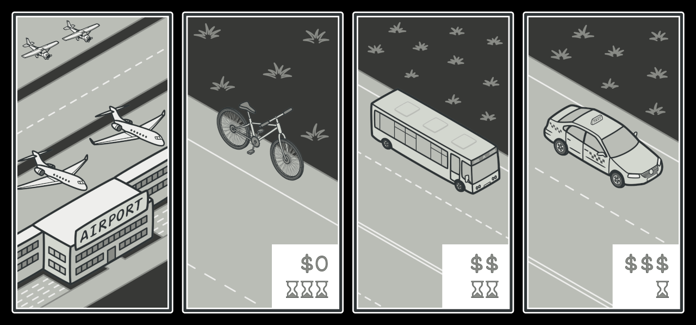

---
title: Summary
notebook: Object Oriented Programming
layout: note
date: 2020-06-16 13:56
tags: 
...

# Summary

[TOC]: #

## Table of Contents
- [Compiling and running](#compiling-and-running)
- [Java features](#java-features)
- [Java Identifiers](#java-identifiers)
- [Classes](#classes)
- [Wrapper classes](#wrapper-classes)
- [Object Oriented Features](#object-oriented-features)
- [Static Members](#static-members)
- [Mutability](#mutability)
- [Standard Methods](#standard-methods)
- [Visibility Modifiers](#visibility-modifiers)
- [Motivation for Inheritance and Polymorphism](#motivation-for-inheritance-and-polymorphism)
- [Inheritance](#inheritance)
  - [Access control](#access-control)
  - [Abstract vs Concrete classes](#abstract-vs-concrete-classes)
  - [`Object` class](#object-class)
- [Interfaces](#interfaces)
  - [Sorting](#sorting)
  - [Inheritance vs Interfaces](#inheritance-vs-interfaces)
- [Polymorphism](#polymorphism)
- [Generics](#generics)
  - [Tuple](#tuple)
  - [Subtyping](#subtyping)
  - [Generic Methods](#generic-methods)
- [Collections](#collections)
  - [Common Operations](#common-operations)
  - [Hierarchy](#hierarchy)
  - [`ArrayList`](#arraylist)
  - [`Comparator`](#comparator)
- [Maps](#maps)
  - [Common operations](#common-operations-1)
  - [Hierarchy](#hierarchy-1)
  - [Use of `HashMap`](#use-of-hashmap)
  - [Sorting with `Map`s](#sorting-with-maps)
- [Exceptions](#exceptions)
  - [Errors](#errors)
  - [Protecting against runtime errors](#protecting-against-runtime-errors)
  - [`try-catch` statement](#try-catch-statement)
  - [`try-with`](#try-with)
  - [Chaining](#chaining)
  - [Generating exceptions](#generating-exceptions)
  - [Types of Exceptions](#types-of-exceptions)
- [Design Patterns](#design-patterns)
  - [Classes of Patterns](#classes-of-patterns)
  - [Singleton Pattern](#singleton-pattern)
  - [Template Method](#template-method)
  - [Strategy pattern](#strategy-pattern)
  - [Factory method](#factory-method)
  - [Observer pattern](#observer-pattern)
- [Software Design](#software-design)
  - [Javadocs](#javadocs)
  - [Code Smells](#code-smells)
  - [GRASP](#grasp)
- [Testing](#testing)
  - [JUnit testing](#junit-testing)
- [Event Programming](#event-programming)
- [Composition over inheritance](#composition-over-inheritance)
- [Enumerated types](#enumerated-types)
- [Variadic Parameters](#variadic-parameters)
- [Functional interface](#functional-interface)
  - [Predicate](#predicate)
  - [Unary operator](#unary-operator)
- [Lambda expressions](#lambda-expressions)
- [Method References](#method-references)
- [Streams](#streams)
- [Scanner](#scanner)
- [Reading files](#reading-files)
- [Packages](#packages)
  - [Defining a package](#defining-a-package)
  - [Using packages](#using-packages)
  - [Default package](#default-package)

## Compiling and running

```bash
# compile
$ javac HelloWorld.java
# compiler outputs HelloWorld.class
# run (no extension)
$ java HelloWorld
```

## Java features

1. compiled and interpreted
2. platform independent
3. object oriented


- Java is compiled to bytecode, then interpreted to machine code
- that bytecode is portable: you can take it to any machine
- porting Java to a new system involves writing a JVM implementation for that system
- most modern implementations of the JVM use **just-in-time** compilation

## Java Identifiers

- *rules*:
  - must not start with a digit
  - all characters must be in {letters, digits, underscore}
  - can theoretically be of any length
  - are case-sensitive
- convention:
  - camelCase for variables, methods, objects
  - class names use capitalised CamelCase
  - constants use UPPER_CASE with underscore

## Classes

- **class**: fundamental unit of abstraction in OOP.  Represents an entity,
  whether physical or abstract that is part of the problem.
  - defines a new data type containing attributes and methods that provides
    a template to generalise things with common properties
- **object**: specific, concrete example of a class
- **instance**: object that exists in your code
- **`this`**: reference to object itself
- **`super`**: reference to object's parent class
- **`final`**: indicates an **attribute, method, or class** can only be assigned,
  declared, or defined once

## Wrapper classes

- **primitive**: unit of information containing only data, with no attributes or methods
- **wrapper**: class providing extra functionality to primitive data types, allowing
  them to behave like objects
- **un/boxing**: process of converting a primitive to/from equivalent wrapper class

## Object Oriented Features

- **data abstraction**: technique of creating new data types well suited to an
  application by defining new classes, comprised of:
  - **attributes**: data an object can contain
  - **methods**: actions an object can perform
- **encapsulation**: ability to group attributes and methods that manipulate
  those attributes as a single entity, by defining a class
  - _not_ provided by procedural programming paradigm
  - **packages**: grouping of classes and interfaces into bundles that can be
    handled together, allowing reuse of code, control of namespace, and access control
    - another example of encapsulation
- **information hiding**: ability to hide details of a class from the outside world
  - allows you to modify implementation without affecting interface
  - **access control**: prevent outside class from manipulating properties of another
    class in undesired ways
- **delegation**: association relationship; "has a".  Class delegates responsibilities
  to another class
  - e.g. Point inside a Circle class representing the centre
- **inheritance**: form of abstraction that allows you to generalise similar attributes and methods
  of classes.  Allows code reuse
- **polymorphism**: ability to process objects differently depending on their
  data type or class

## Static Members

- **static member**: method/attribute not specific to an object of the class
- **static variable**: variable shared among all objects of the class, i.e. a
  single instance is shared among classes.  Accessed using class name.
- **static method**: method that does not depend on (access or modify) any instance
  variables of the class. Invoked using the class name
  - can only call other static methods
  - can only access static data
  - cannot refer to `this`, `super` as they are related to objects

## Mutability

- **mutable**: a class is mutable if it contains public mutator methods that can
  change instance variables
- **immutable**: a class with no methods that can change instance variables (except
  constructors)

## Standard Methods

- **`equals`**: allows object comparison (implemented as dictated by the needs of the class)
- **`toString`**: produces a string representation of an object
- **`copy`**: creates a separate copy of the object provided as input; should be
  a deep copy

## Visibility Modifiers

- **access control**
  - safely seals data in capsule of class
  - prevents programmers from relying on details of class implementation
  - helps protect against accidental/wrong usage
  - keeps code elegant, clean, making maintenance easier
  - provides access to an object through a clean interface

- **`public`:** available/visible _everywhere_ (within/outside the class)
  - anyone can use it
- **`private`:** only visible _within_ a class
  - methods/attributes
  - not visible within subclasses
  - not inherited
- **`protected`:** only visible within class, subclasses, and all classes in the same package
  - methods/attributes
  - visible to subclasses in other packages
- **default:** visibility modifier omitted;
  - can be accessed within other classes in the same package, but not from
    outside the package

|  Modifier   | Class | Package | Subclass | Outside |
|:-----------:|:-----:|:-------:|:--------:|:-------:|
|  `public`   |   Y   |    Y    |    Y     |    Y    |
| `protected` |   Y   |    Y    |    Y     |    N    |
|  `default`  |   Y   |    Y    |    N     |    N    |
|  `private`  |   Y   |    N    |    N     |    N    |

## Motivation for Inheritance and Polymorphism

- without inheritance/polymorphism
  - repeated code: hard to implement/debug/maintain
  - doesn't represent similarity/relationship between entities
  - difficult to extend

## Inheritance

- **superclass**: parent/base class in inheritance relationship, providing general
  information to child classes
- **subclass**: derived/child class in inheritance relationship, inheriting common
  attributes and methods from parent class.  More specific form of superclass
  - subclasses contain all public/protected instance variables/methods in base class
- **`extends`**: indicates one class inherits from another

```java
public class Subclass extends Superclass { ... }
```

- represents an ___is a___ relationship (__associaton__)

### Access control

- child classes cannot call `private` methods, and cannot access `private` attributes of
  parent classes
- child classes can call `protected` methods, and can access `protected` attributes
  of parent classes
- **privacy leak**: child classes modifying `protected` attributes of parent class
  can produce privacy leaks, as these modifications won't be subject to any validation
  checks, potentially producing invalid state
  - preferable for parent class to access attributes through `public`/`protected`
    methods of parent class
- `protected` methods: use when methods will only be used by subclasses
- child class cannot further restrict visibility of an overridden method:
  - `public` in parent: `public` in child
  - `protected` in parent: `protected` or `public`
  - `private` method cannot be overridden
- **shadowing**: variables declared with the same name in overlapping scopes, e.g.
  in subclass and superclass.  Variable accessed depends on reference type rather
  than the object.
  - avoid doing it.  Define common variables in the superclass.
- **`getClass`**: returns object of type `Class` representing details of calling
  object's class
- **`instanceof`**: operator that returns `true` if an object A is an instance of the
  same class as object B, or a class that inherits from B:

```java
new Rook() instanceof Piece;     // true
new Piece() instanceof Rook;     // false
```

- **upcast**: object of a child class is assigned to variable of ancestor class
- **downcast**: object of an ancestor class is assigned to a variable of a child class
  - only works if underlying object is actually of that class
  - use with care!  Lots of downcasting is a smell
- **abstract method**: defines superclass method common to all subclasses with no
  implementation.  Each subclass then implements the method via overriding.
  - `<visibility> abstract <returnType> <methodName>(<args>);`
  - classes with abstract methods must be abstract
- **abstract class**: defines an incomplete class
  - General concepts that are not fully realised but provides useful grouping, with
    specific details implemented in subclasses
  - represent an incomplete concept than some real entity used in solving a problem
  - cannot be instantiated
  - `<visibility> abstract class <ClassName> { ... }`
  - abstract classes may have abstract methods
- **concrete class**: class that is not abstract, that is fully defined, in terms
  of actions it can take.  Can be instantiated. 

### Abstract vs Concrete classes


### `Object` class

- every class in Java implicitly inherits from the `Object` class
- all classes are of type `Object`
- all classes have a `toString` method: by default prints out `<class name>@<hash code>`
- all classes have an `equals` method: by default it compares references

## Interfaces

- **interface**: declares set of constants and methods that define the behaviour of
  an object
  - represents a ___can do___ relationship
  - usually named `<...>able`, relating to an action
  - e.g. classes implementing `<Drivable>` interface implement `drive` method
  - methods never have any code
  - all methods are implicitly `abstract`
  - all attributes are implicitly `static final`
  - all methods/attributes are implicilty `public`

```java
public interface Printable {
    int MAXIMUM_PIXEL_DENSITY = 1000;
    void print();
}
```

- **`implements`**: declare that a class implements all functionality defined by an interface
  - concrete classes must implement all methods, otherwise they must be abstract

```java
public class Image implements Printable {
    public void print() { ... }
}

public class Spreadsheet implements Printable {
    public void print() { ... }
}
```

- default method: you can define default behaviour of interface that can be
  subsequently overridden

```java
public interface Printable {
    default void print() {
        System.out.println(this.toString()); 
    }
}
```

- interfaces can be extended like classes, forming the same ___is a___ relationship

```java 
public interface Digitisable extends Printable {
    public void digitise();
}
```

- classes can inherit only one class, but can implement multiple interfaces: allows
  you to build powerful abstractions, making it much easier to create solutions

```java
public class Spreadsheet extends Document implements Printable, Colourable, Filterable,
  Comparable<Spreadsheet> {
    public void print() { ... } 
    ...
}
```

### Sorting

- Classes implementing `Comparable<ClassName>` interface
  - can be compared with objects of same class
  - must implement `public int compareTo(<ClassName> object)`
  - allows them to be sorted without needing to implement sorting algorithms yourself
- `compareTo`: compares object A to object B
  - B may be a subclass of A as long
  as they both implement `Comparable`
  - returns < 0 if this A < argument B
  - returns 0 if this A = argument B
  - returns > 0 if this A > argument B

### Inheritance vs Interfaces

- inheritance: generalises shared properties between similar classes, ___is a___
- interfaces: generalise shared behaviour between potentially dissimilar classes,
  ___can do___

- subtype polymorphism applies to interfaces and inheritance:
```java 
// inheritance
Robot robot = new WingedRobot(...);
// interfaces
Comparable<Robot> comparable = new Robot(...);
```

- All `Animal`s including `Dog`s and `Cat`s can make noise: inheritance, as `Dog`
  and `Cat` are clearly related and will share common properties
- All `Animal`s and `Vehicle`s can make noise: interface, as no similarity between
  `Animal` and `Vehicle`
- All classes can be compared with themselves: `Comparable` interface
- Some `GameObject`s can move, some can talk, some can be opened, some can attack:
  interfaces `Movable`, `Talkable`, `Attackable` implemented by particular classes inheriting
  from `GameObject`

## Polymorphism

- **polymorphism**: ability to use objects/methods in many different ways (many forms)
- **method overloading**: ability to define method with the same name but different
  signatures.  Superclass methods can be overloaded in subclasses
  - ad hoc polymorphism
- **method overriding**: declaring a method that exists in a superclass again in
  a subclass with identical signature.  Methods can only be overridden by subclasses
  - subtype polymorphism
  - extend/modify functionality of parent
  - makes subclass behaviour available when using superclass references
  - defines interface in superclass with particular behaviour implemented in subclass
  - uses `@Override` annotation optionally
  - cannot change return type
  - `private` methods cannot be overridden
  - `final` methods cannot be overridden
- **substitution**: use subclasses in place of superclasses
  - subtype polymorphism
- **generics**: parametrised methods/classes
  - parametric polymorphism

## Generics

- facilitate code re-use by enabling generic logic to be written to apply to any
  class type
- **generic class**: class defined with an arbitrary type for a field, parameter
  or return type
  - type parameter can have any reference type plugged in (any class type)
- limitations:
  - cannot instantiate parametrised objects
  - cannot create arrays of parametrised objects
- benefits:
  - flexibility to reuse code for any type
  - allow objects to keep their type (rather than be upcast to `Object`)
  - allows compiler to detect errors during development rather than producing run-time errors

```java
T item = new T(); // <- cannot do this!
T[] elements = new T[];     // <- cannot do this!
```

```java
public class Sample<T> {
    private T data;
    
    public void setData(T data) {
        this.data = data;
    }
    
    public T getData() {
        return data;
    }
}
```

### Tuple

From _Thinking in Java_

```java 
public class TwoTuple<A, B> {
    public final A first;
    public final B second;
    
    public TwoTypePair(A first, B second) {
        this.first = first;
        this.second = second;
    }
    
    @Override
    public String toString() {
        return "(" + first + ", " + second ")";
    }
}
```

Usage:

```java
public class TwoTupleDemo {
    public static void main(String[] args) {
        TwoTuple<String, Integer> rating = new TwoTuple<String, Integer>("The Car Guys", 8);
        System.out.println(rating);
    }
}
```

### Subtyping

- **generic subtyping**: generic classes/interfaces are not related merely because
  the type parameters are related
  - e.g. `List<Dog>` is not a subtype of `List<Animal>`
  - in general: `T1<X> <: T2<X>` if `T1 <: T2`
  - `<:` : _is subtype of_
  - e.g. `ArrayList<String>` is subtype of `List<String>` as `ArrayList` is subtype of `List`:

```java 
ArrayList<String> arrayListStr = new ArrayList<String>();
List<String> listStr = arrayListStr;
```

- **generic wildcard**: allows you to read and insert to a generic collection

```java
List<?> listUnknown = new ArrayList<A>(); // unknown wildcard
List<? extends A> listUnknown = new ArrayList<A>(); // extends wildcard
List<? super A> listUnknown = new ArrayList<A>();   // super wildcard
```

- **unknown wildcard**: list typed to unknown type; can only read the collection
  - read-only collection
- **extends wildcard**: `List<? extends A>` means list of objects of type A or
  subclass of A
  - we can read the list and cast elements to type A
  - read-only collection
- **super wildcard**: `List<? superA>` means list of objects of type A or superclass
  of A
  - safe to insert elements of type A or subclasses of A

```java
public void insert(List<? super Animal> myList) {
    myList.add(new Dog());
    myList.add(newBear());
}

List<Animal> animals = new ArrayList<Animal>();
insert(animals);
Object o = animals.get(0);  // upcast to object. Works
Animal a = animals.get(0);  // downcast to animal; error as list could be of type that is
                            // superclass of animal
  
List<Object> objects = new ArrayList<Object>(); 
insert(objects);    // this is fine.  Object is a superclass of Animal
```

### Generic Methods

- **generic method**: method that accepts arguments or returns objects of arbitrary type
  - can be defined in any class
  - type parameter is local to the method

```java 
public <T> int genericMethod(T arg);        // generic argument
public <T> T genericMethod(String name);    // generic return value
public <T> T genericMethod(T arg);          // generic arg + return val
public <T,S> T genericMethod(S arg);        // generic arg + return val
```

## Collections

- **Collections**: framework that permits storing, accessing, manipulating lists
  - _ordered_ collection
- most useful:
  - `ArrayList`: improved arrays
  - `HashSet`: ensure unique elements
  - `PriorityQueue`: order elements non-trivially
  - `TreeSet`: fast lookup/search for unique elements

### Common Operations

- length: `int size()`
- presence: `boolean contains(Object element)`
  - requires implementation of `equals(Object element)`
- add: `boolean add(E element)`
- remove: `boolean remove(Object element)`
- iterating: `Iterator<E> iterator()`
  - `for (T t : Collection<t>)`
- retrieval: `Object get(int index)`

### Hierarchy


### `ArrayList`

- class with an array as an instance variable
- iterable (`for-each` loops)
- handles resizing automatically
- allows you to insert, remove, get, modify, ...
- has `toString` available
- easily sorted if stored element class implements `Comparable<T>` interface
  - sorting invoked by `Collections.sort(list);`
- can be used for storing different types of objects that inherit from the same
  base class: allows seamless execution of common behaviour; you can simply apply
  the common method to every item without having to worry about what type of class it is
- cannot be directly indexed
- limitations:
  - doesn't shrink automatically: can use excessive memory; `trimToSize()`
  - cannot store primitives

### `Comparator`

- implement different sorting approaches by implementing `Comparator<T>` interface
  - requires implementation of `compare(T obj1, T obj2);`, behaving similar to
    `compareTo`
  - can invoke as `Collections.sort(list, new Comparator<T>() { ... });`, where
    the `Comparator` is implemented as an ___anonymous inner class`

## Maps

- **Maps**: framework that permits storing, accessing, manipulating _key-value pairs_

### Common operations

- Length: `int size()`
- Presence: `boolean containKey(Object key)`
  - `boolean containValue(Object value)`
- Add/replace: `boolean put(K key, V value)`
- Remove: `boolean remove(Object key)
- Iterating: `Set<K> keySet()`
- Iterating: `Set<Map.Entry<K,V>> entrySet()`
- Retrieval `V get(Object key)`

### Hierarchy


### Use of `HashMap`

```java   
import java.util.HashMap;

public static void main(String[] args) {
    HashMap<String,Book> library = new HashMap<>();
    Book b1 = new Book("JRR Tolkien", "The Lord of the Rings", 1178);
    Book b2 = new Book("George RR Martin", "A Game of Thrones", 694);
    library.put(b1.author, b1);
    library.put(b2.author, b2);
    
    for (String author: library.keySet()) {
        Book b = library.get(author);
        System.out.println(b);
    }
}
```

### Sorting with `Map`s

Here's an example of sorting a `HashMap` by value, in reverse order, and printing
the result:

```java
public class Program {
    public static void main(String[] args) {
        Map<String, Integer> map = new HashMap<>();
        map.put("orange", 1);
        map.put("potato", 2);
        map.put("banana", 5);
        map.put("pineapple", 4);
        map.put("apple", 3);
        map.put("blueberry", 6);

        map.entrySet()
                .stream()
                .sorted(Collections.reverseOrder(Map.Entry.comparingByValue()))
                .forEach(System.out::println);

    }
}
```

Output:

```
blueberry=6
banana=5
pineapple=4
apple=3
potato=2
orange=1
```

## Exceptions

### Errors

- **syntax**: what you write isn't legal code; identified by compiler
- **semantic**: code runs to completion but produces incorrect output; identified
  by testing
- **runtime**: causes program to end prematurely; identified through execution
  - divide by zero
  - accessing out of bounds element of array
  - file errors

### Protecting against runtime errors

- **defensive programming**: explicitly guard against invalid conditions
  - not always applicable: some failures don't have backup path
  - need to account for all possible error conditions
  - difficult to read
  - poor abstraction
- **exception handling**: catch error states and recover or gracefully exit;
  - actively protect program in case of exception
- **exception**: error state created by runtime error
  - object created by Java to represent the error encountered
  - should be reserved for unusual/unexpected cases that cannot be easily handled

### `try-catch` statement

```java 
public void method(...) {
    try {
        // code to execute that may cause an exception
    } catch (<ExceptionClass> varName) {
        // code to execute to recover from exception/end gracefully
    } finally {
        // block of code that executes whether an exception occurred or not
    }
}
```

- **`try`**: attempt to execute code
- **`catch`**: deal with particular exception, whether recover or failure
- **`finally`**: perform clean up assuming the code didn't exit

### `try-with` 

```java 
public void processFile(String filename) {
    try (BufferedReader reader = ...) {
        ...
    } catch (FileNotFoundException e) {
        e.printStackTrace();
    } catch (IOException e) {
        e.printStackTrace();
    }
}
```

- resource is automatically closed with `try-with` notation, as opposed to using
- separate `finally` block

### Chaining

- can chain `catch` blocks to handle different exceptions separately 

```java 
public void processFile(String filename) {
    try {
        ...
    } catch (FileNotFoundException e) { // most specific exception
        e.printStackTrace();
    } catch (IOException e) {           // least specific exception
        e.printStackTrace();
    }
}
```

### Generating exceptions

- **`throw`**: respond to error state by creating an exception object

```java
if (t == null) {
  throw new NullPointerException("t is null!");
}
```

- **`throws`**: indicate a method has potential to create an exception, and doesn't
  handle it

```java
class SimpleException extends Exception {}    // define a new exception extending Exception

public class InheritingExceptions {
    public void f() throws SimpleException {
        System.out.println("Throw SimpleException from f()");
        throw new SimpleException();
    }
    
    public static void main(String[] args) {
        InheritingExceptions sed = new InheritingExceptions();
        try {
            sed.f();
        } catch (SimpleException e) {
            System.out.println("Caught SimpleException!");
        }
    }
}
```

### Types of Exceptions

- **unchecked**: inherit from `Error`.  Can be safely ignored by programmer
  - most Java exceptions are unchecked because you aren't forced to protect against
    them
- **checked**: inherit from `Exception`.  Must be explicitly handled by the programmer
  - produces compile-time error if checked exception is ignored
  - handle by:
    - enclosing code that can generate exceptions in `try-catch` block
    - declaring that a method may create an exception using `throws` clause

## Design Patterns

- **design pattern**: description of a solution to a recurring problem in software design

### Classes of Patterns

- **creational**: solutions to object creation; e.g. Singleton, Factory method
- **structural**: solutions dealing with structure of classes and relationships
- **behavioural**: solutions dealing with interaction among classes e.g. Strategy,
  template, observer

### Singleton Pattern

- creational pattern


- **Intent**: Ensure that a class has only one instance, and provide a global point of access
- **Motivation**: Need to enforce single instance of a class with easy access
- **Applicability**: when a single instance of a class is required
- **Consequences**: Use with caution.  Inappropriate use can produce bad design
  - difficult to unit test
  - can mask bad design (e.g. components know too much about each other)
  - solves two problems at the same time: uniqueness of instance and access to instance
- **Known uses**: `CacheManager`, `PrintSpooler`, `Runtime`j

```java 
class Singleton {
    private static Singleton _instance = null;
    private Singleton() {   // <- private constructor prevents instantiation except by class itself
        ...
    }
    
    public static Singleton getInstance() {
        if (_instance == null) {
            _instance = new Singleton();
        }
        return _instance;
    }
}

// Collaboration
class TestSingleton {
    public void method1() {
        X = Singleton.getInstance();
    }
    
    public void method2() {
        Y = Singleton.getInstance();
    }
}
```

### Template Method

- behavioural pattern
- uses __inheritance__ to separate generic algorithm from detailed design


- **Intent**: family of encapsulated algorithms that can be interchanged
- **Motivation**: build generic components that are easy to extend and reuse
- **Applicability**: implement invariant parts of algorithm once, and leave to subclass
  to implement varying behaviour
- **Consequences**: all algorithms must use the same interface

- e.g. `BubbleSorter`


### Strategy pattern

- behavioural pattern
- uses __delegation__ to separate generic algorithm from detailed design


- **Intent**: define family of algorithms that can be interchanged
- **Motivation**: want to switch variants of algorithm at runtime
- **Applicability**:
  - many similar classes that only differ in behaviour execution
  - isolate business logic from implementation details of algorithms
- **Consequences**:
  - able to swap algorihtms
  - replace inheritance with composition
  - introduce new strategies without changing context
  - may overcomplicate design if small number of algorithms
  - clients need to know how to select algorithms

- e.g. Google maps: transport strategy of bike, bus, taxi with different time and cost



[Strategies for getting to the airport](https://refactoring.guru/design-patterns/strategy)

- e.g. `BubbleSorter` has a class implementing `SortHandle` that can be called to do specific sorting
methods.

### Factory method

- creational pattern

- without factory:
  - create objects in the class that needs them
  - code duplication
  - rigid, fragile classes
  - inaccessible information
  - poor abstraction
- with factory:
  - define separate operation to create an object
  - delegates object creation to subclasses
  - abstracts object creation by using factory method
  - encapsulates objects by allowing subclasses to determine what they need
  - you can introduce new products without breaking client code
  - avoid tight coupling between creator and concrete products
  - product creation is in one place, making it easy to maintain
  - code may become more complicated: lots of new subclasses to implement the pattern

- **factory**: general technique for manufacturing objects
- **product**: abstract class that generalises the objects produced by the factory
- **creator**: class that generalises the objects that consume products
  - has an operation that invokes the factory method


- **Intent**: generalise object creation.  Allows client to request type of object
  it needs, without worrying about details
- **Applicability**: sister classes depend on similar objects
- **Consequences**: object creation in superclass decoupled from specific object
  required

- e.g. cross-platform UI elements


### Observer pattern

- behavioural pattern
- many objects depend on the state of one subject:
- **subject**: important object, whose state determines actions of other classes
- **observer**: object that monitors the subject to respond to changes
- observer pattern decouples subject and observers using ___publish-subscribe___
  communication
- useful for event-driven programs


- **Intent**: provide subscription mechanism to notify multiple objects about events
  that happen to subject
- **Motivation**: prevent awkward information passing
- **Applicability**: changes to the state of one object requires changing many other
  objects, and the set of objects is not known in advance
- **Consequences**:
  - prevents awkward information passing
  - decouples subject and observer
  - clear responsibilities: subjects know nothing about observers except that they
    exist
  - establish runtime relations between observer and subject

## Software Design

### Javadocs

- special kind of comment that compiles to HTML
- intended for developers ___using___ your program
- documents how to use and interact with your classes and methods

### Code Smells

- **rigidity**: hard to modify because changes in one class/method cascade to many others
- **fragility**: change one part breaks unrelated parts
- **immobility**: cannot decompose into reusable modules
- **viscosity**: hacks to preserve design
- **complexity**: premature optimisation; clever code currently unnecessary
- **repetition**: copy-paste
- **opacity**: convulted logic; hard to follow design

### GRASP

- **GRASP**: guidelines for assigning responsibility to classes in object-oriented design
  - how to break down a problem into modules with clear purpose

- General
- Responsibility
- Assignment
- Software
- Patterns/principles

- **cohesion**: classes designed to solve clear, focused problems, with methods/attributes
  related to and working towards this objective
  - aim for high cohesion
- **coupling**: degree of interaction between classes; dependency.
  - aiming for low coupling
- **open-closed principle**: classes should be open to extension, closed to modification
  - if we need to change/add functionality, use inheritance rather than modifying
    original
- **abstraction**: solve problems by creating abstract data types to represent problem
  components.  In OOP use classes.
- **encapsulation**: details should be kept hidden/private.  User's ability to access hidden
  details is restricted/controlled.  Also known as information hiding.
- **polymorphism**: ability to use an object or method in many different ways
- **delegation**: keeping classes focused by passing work on to other classes
  - computations should be performed in the class with the greatest amount of relevant information

## Testing

- **unit**: small, well-defined component of a software system with one/small number of responsibilities
- **unit test**: verify operation of a unit by testing single use case
- **unit testing**: identifying bugs by subjecting all units to a suite of tests
- **manual testing**: ad-hoc manual tests.  Difficult to reach edge cases. Not scalable
- **automated testing**: testing via automated testing software.  Faster, reliable, less reliant on humans
  - easy to set up
  - scalable
  - repeatable
  - not human intensive
  - powerful
  - finds bugs
- **software tester**: conducts tests on software to find and eliminate bugs
- **software quality assurance**: works to improve development process/lifecycle.  Directs
  software testers to conduct tests

### JUnit testing

- **assert**: true/false statement indicating success/failure of test case
- **`TestCase`**: class dedicated to testing single unit
- **`TestRunner`**: class that executes tests on a unit

```java
import static org.junit.Assert.*;
import org.junit.Test;

public class BoardTest {
    @Test
    public void testBoard() {
        Board board = new Board();
        assertEquals(board.cellIsEmpty(0, 0), true);
    }
    
    @Test
    public void testValidMove() {
        Board board = new Board();
        Move move = new Move(0, 0);
        assertEquals(board.isValidMove(move), true);
    }
    
    @Test
    public void testMakeMove() {
        Board board = new Board();
        Player player = new HumanPlayer("R");
        Move move = new Move(0, 0);
        board.makeMove(player, move);
        assertEquals(board.getBoard()[move.row][move.col], "r");
    }
}
```

```java 
import org.junit.runner.JUnitCore;
import org.junit.runner.Result;
import org.junit.runner.notification.Failure;

public class TestRunner {
    public static void main(String[] args) {
        Result result = JUnitCore.runClasses(BoardTest.class);
        for (Failure failure : result.getFailures()) {
            System.out.println(failure.toString());
        }
        System.out.println(result.wasSuccessful());
    }
}
```

## Event Programming

- **sequential programming**: program is run top to bottom
  - useful for static programs with constant unchangeable logic
  - execution roughly the same every time
  - not dynamic
- **state**: properties that define an object
- **event**: created when state of an object/device/... is altered
- **callback**: method triggered by an event
- **event-driven programming**: use events and callbacks to control flow of program
  execution e.g. exception handling, observer pattern
  - better encapsulate classes by hiding behaviour
  - avoid explicitly sending information about input, pass it as part of callback
  - add/remove behaviour easily
  - add/remove responses easily
  - e.g. GUI, web development, embedded systems/hardware
- **event loop/polling**: infinite loop checking whether an event has occurred
  - lots of waiting
  - lots of wasted effort
  - always responds in same order
  - cannot escape one method to respond to something more urgent
- **interrupt**: signal generated by hardware/software indicating an event that
  requires immediate CPU attention
  - e.g. exception/error handling
  - e.g. repeat event on timed interval
  - e.g. device input: key press on keyboard
- **interrupt service routine**: event-handling code to respond to interrupt signals

## Composition over inheritance


- **entity-component** approach is an example of **composition over inheritance**
- simplifies things by using composition instead of inheritance
- prevent you being restricted into an inflexible class hierarchy
- allows you to mix and match behaviour as needed e.g. `ZombieWerewolf` cannot inherit
  from both `Zombie` and `Werewolf` while it will exhibit behaviours from both
- creates much simpler and more flexible design
- minimises code duplication


## Enumerated types

- **enum**: class consisting of a finite list of named constants
  - used any time you need to represent a fixed set of values
  - `ordinal()`: gives you the position of enum in the class (0-based)

```java
public enum Suit {
    SPADES(Colour.BLACK),
    CLUBS(Colour.BLACK),
    DIAMONDS(Colour.RED),
    HEARTS(Colour.RED);

    private Colour colour;
    private Suit(Colour colour) {
        this.colour = colour;
    }
}
```

## Variadic Parameters

- **variadic method**: method taking an unknown number of arguments
  - implicitly convert input arguments to an array

```java
public String concatenate(String... strings) {
    String string= "";
    for (String s : strings) {
        string += s;
    }
    return string;
}
```

## Functional interface

- **functional interface**: interface containing only a single abstract method
  - aka Single Abstract Method interface
  - can contain only one new non-static method

### Predicate

```java
public interface Predicate<T>
```

- represents a predicate, accepting one argument and returning a boolean
- executes `boolean test(T t)` method on a single object
- can be combined with other predicates using logical operation methods

### Unary operator

```java
public interface UnaryOperator<T>
```

- represents unary (single argument) function accepting one argument and returning
  an object of the same type
- executes `T apply(T t)` method on a single object

## Lambda expressions

- **lambda expression**: treats code as data that can be used as an object
  - allows you to instantiate an interface without implementing it
  - allows you to pass a function as an argument to a function
  - instances of functional interfaces
  - make code neater and easier to read
  - can often be used in place of anonymous classes, but are not the same

```java
Predicate<Integer> p = i -> i > 0;  // very compact way to define function
```

Syntax:
```java
(sourceVar1, sourceVar2, ...) -> <operation on source variables>
```

## Method References

- **method reference**: an object that stores a method; can take the place of a lambda
  expression if lamdba expression only calls a single method
  
```java
UnaryOperator<String> operator = s -> s.toLowerCase();
UnaryOperator<String> operator = String::toLowerCase;
```

## Streams

- **stream**: series of elements given in sequence, automatically put through a
  pipeline of operations
  - **map**: apply a function element-wise
  - **filter**: select elements with a condition
  - **limit**: perform a maximum number of iterations
  - **collect**: gather elements for output
  - **reduce**: perform aggregation into a single value

e.g.
```java
String output = people.stream() 
                        .filter(p -> p.getAge() >= 18)
                        .filter(p -> p.getAge() <= 40)
                        .map(Person::getName)
                        .map(string::toUpperCase)
                        .collect(Collectors.joining(", "));
```

## Scanner

- only ever create one instance of `Scanner` in a program
- `next` returns next complete token (up to next delimiter)
- `nextLine` is the only method that eats newline characters
- `Scanner` does not automatically downcast (e.g. `float` to `int`)
- sometimes you need to follow `nextXXX` with `nextLine` if input is across multiple lines

```java
import java.util.Scanner;

public class ScannerProgram {
    public static void main(String[] args) {
        Scanner scanner = new Scanner(System.in);  // create Scanner reading from System.in
        System.out.println("Enter your input: ");
        while (scanner.hasNextLine()) {     // while there are more lines to read
            String s = scanner.nextLine();  // read the next line
            System.out.println(s);
        }
    }
}
```


## Reading files

```java
import java.io.FileReader;      // low level file for simple character reading
import java.io.BufferedReader;  // higher level file object that reads Strings
import java.io.IOException;     // handle exceptions

public class ReadFile {
    public static void main(String[] args) {
        try (BufferedReader br = new BufferedReader(new FileReader("test.txt"))) {
            String text;
            while ((text = br.readLine()) != null) {
                // do stuff with text
            }
        } catch (Exception e) {
            e.printStackTrace();
        }
    }
}
```

- can also use `Scanner` to read a file, parsing as well as reading the text
  - slower, smaller buffer, but works for small files

## Packages

### Defining a package

First statement in class as follows:

```java 
package <directory_name_1>.<directory_name_2>;
```

### Using packages

```java
import <packageName>.*;  // import all classes in package
import <packageName>.<className>; // import particular class
```

- Parent directory of `<packageName>` must be in `CLASSPATH` environment variable

### Default package

- all classes in current directory belong to unnamed `default` package, that is
  implicitly included
