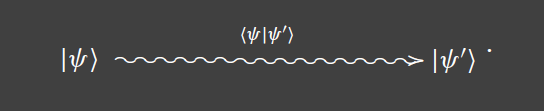

---
title: Quantum Theory
notebook: Quantum Computing
layout: note
date: 2020-12-10
tags: quantum states, observables, measurement, entanglement
...

## Quantum States

## Early 20th Century physics

- classical mechanics viewed matter as composed of particles, and light as composed of continuous electromagnetic waves
- __diffraction experiment:__ beam of subatomic particles hitting a crystal diffract in a wave-like pattern
  - de Broglie wavelength associated with matter
- __photoelectric effect:__ an atom hit by a beam of light may absorb it, causing electrons transition to a higher energy orbital
  - absorbed energy may be emitted as light causing electrons to transition back to the original orbital
  - light-matter transactions always occur via discrete packets of energy, i.e. photons
- further experimental evidence: old duality particle-wave theory needed to be replaced by a theory in which __both__ matter and light
  can exhibit both particle- and wave-like behaviour.
- __Young's double slit experiment:__ shine light at a boundary with 2 very close slits, between the light source and an observing wall
  - pattern of light on the wall varies between light and dark as a result of interference between light
  - with one slit closed, no interference pattern is observed
  - remarkable results: 
    - double-slit experiment can be performed with a single photon: if there is a single photon, why would there be any interference pattern?
    - can also be performed with electrons, protons, atomic nuclei, bucky balls, all of which exhibit interference behaviour
- conclusion: rigid distinction between waves and particles as a means of describing the physical world is untenable at the quantum level

## Quantum States

### Particle on a line

- consider a subatomic particle on a line that may only be found at one of several equally spaced points $\{x_0, ..., x_{n-1}\}$ separated by distance $\delta x$
- describe the current state of the particle as a complex vector $[c_0, ..., c_{n-1}]^T$
- denote the particle being at point $i$ as $\ket{x_i}$ (a __ket__)
- each basic state has an associated column vector $\ket{x_i} \rightarrow \delta_{ij} \in \mathbb{C}^n$
- note these vectors form the canonical basis of $\mathbb{C}^n$
- in quantum physics, the particle can be in a fuzzy blending of states: all vectors in $\mathbb{C}^n$ represent a legitimate physical state
- __superposition:__ an arbitrary state $\ket \psi$ is then a linear combination of the basic states $\ket{x_i}, ..., \ket{x_{n-1}}$ with __complex amplitudes__ $c_0, ..., c_{n-1}$
  - represents particle being simultaneously in all locations, a blending of all $\ket{x_i}$

$$
\ket \psi = c_0\ket{x_0} + ... + c_{n-1}\ket{x_{n-1}}
$$

- every state can therefore be represented as an element of $\mathbb{C}^n$ as 

$$
\ket \psi \rightarrow [c_0, ..., c_{n-1}]^T
$$

- probability that, after observing the particle, we will detect it at point $x_i$:

$$
p(x_i) = \frac{|c_i|^2}{|\ket \psi|^2} = \frac{|c_i|^2}{\sum_j{|c_j|^2}}
$$

- clearly $p(x_i) \in \mathbb{R}$ and $0 \le p(x_i) \le 1$
- when $\ket \psi$ is observed, it will be found in one of the basic states
- kets can be added: $\ket \psi + \ket \psi' = [c_0 + c_0', ..., c_{n-1}+c_{n-1}']^T$
- a ket $\ket \psi$ and its scalar multiples $c\ket \psi$ (for some $c \in \mathbb{C}$) describe the same physical state
- the length of $\ket \psi$ doesn't matter as far as physics goes
- it then makes sense to work with a __normalised ket__ with length $1$:

$$
\frac{\ket \psi}{|\ket \psi|}
$$

- for a normalised ket, we have $p(x_i)=|c_i|^2$ 

### Spin

- property of subatomic particles which is the prototypical way to implement qubits
- __Stern-Gerlach experiment:__ electron in presence of magnetic field observed to behave as if it were a charged spinning top,
  by acting as a magnet and trying to align itself with the magnetic field
  - experiment: shoot beam of electrons through a magnetic field oriented in a certain direction
  - beam is split into 2 streams with opposite spin
- differences to classical spinning top:
  - electron doesn't have internal structure: quantum property with no classical analog
  - all electrons can be found in 1 of 2 locations, not distributed between (spin can be clockwise/anticlockwise)
- for each direction in space, there are only 2 spin states, spin __up__ $\ket \uparrow$ and __down__ $\ket \downarrow$
- arbitrary state is then a superposition of up and down:

$$
\ket \psi = c_0\ket \uparrow + c_1 \downarrow
$$

- inner product: modifies vector space into a space with _geometry_, adding angles, orthogonality, distance 
- inner product of state space allows computation of __transition amplitudes__, which you can use to determine the likelihood
  the state of the system before a specific measurement will change to another state after measurement has occurred
- consider two normalised states $\ket \psi$, $\ket {\psi'}$
- let the start state be $\ket \psi$, and the end state a row vector with complex conjugate coordinates of $\ket{\psi'}$
- define the __bra___ $\bra {\psi'} = \ket{\psi}^\dagger = [\overline{c_0'}, ..., \overline{c_{n-1}'}]$
- the transition amplitude is then the inner product __bra-ket__

$$
\braket{\psi'|\psi} = [\overline{c_0'}, ..., \overline{c_{n-1}'}]
\begin{bmatrix}
  c_0 \\
  \vdots \\
  c_{n-1}
\end{bmatrix}
$$

- represent the start state, end state, and amplitude of going between these states as:

- bra-ket approach shifts focus from states to state transitions
- the transition amplitude between two states is zero when two states are orthogonal: orthogonal states are mutually exclusive alternatives
- e.g. an electron can be in arbitrary superposition of spin up and down, but after measurement in the z-direction, it will always be _either_ up or down,
  not _both_ up and down
  - if the electron was already in the up state before the z-direction measurement, it will never transition to a down state as a result of that measurement
- every complete measurement of a quantum system has an associated orthonormal basis of all possible outcomes
- with $\ket \psi$ in the basis $\{\ket{b_0}, ..., \ket{b_{n-1}}\}$, i.e.

$$
\ket \psi = \sum_{i=0}^{n-1}{b_i\ket{b_i}}
$$

- each $|b_i|^2$ is the probability of ending up in state $\ket{b_i}$ after a measurement has been made

### Summary

- we can associate a vector space with a quantum system, with its dimension reflecting the number of basic states of the system
- states can be superposed by adding their representing vectors
- a state is left unchanged if its representing vector is multiplied by a complex scalar
- the state space has a geometry given by its inner product: this has a physical meaning, namely the likelihood of a given state to transition to another one after
  measurement
- orthogonal states are mutually exclusive

## Observables

- physical quantities only make sense with respect to a quantifiable observation
- a physical system can be specified by a pair: _(state space, observables)_
  - __state space:__ set of all states the system may occupy
  - __observables:__ set of physical quantities able to be observed in each state of the state space
- each observable can be considered a question we can pose to the system: if the system is in a particular state $\ket \psi$ what values can we observe?
- __Postulate:__ each physical observable has a corresponding hermitian operator
  - _reminder:_ Hermitian means $A^\dagger = A$
  - an observable is a linear operator: it maps states to states
  - the application of an observable $\Omega$ to a state vector $\ket \psi$ is the resulting state $\Omega \ket \psi$
  - in general $\Omega \ket \psi$ is not a scalar multiple of $\ket \psi$; they do not represent the same state, i.e. $\Omega$ has modified the 
    state of the system
- __Postulate:__ let $\Omega$ be a hermitian operator associated with a physical observable.  Then the eigenvalues of $\Omega$ are the only possible values the
  observable can take as a result of measuring it on any given state.  The eigenvectors of $\Omega$ form a basis for the state space.
- so observables can be considered legitimate questions we can pose to quantum systems. The question may be answered with the eigenvalues of the observable

### Position

- specific question: "where can the particle be found?"
- what's the corresponding hermitian operator, $P$, for position?
  - how does it operate on basic states e.g. $\ket {x_i}$? $P(\ket \psi) = P(\ket {x_i}) = x_i \ket \psi$: $P$ acts as multiplication by position
  - the basic states form a basis, so for an arbitrary stat: $P(\sum{c_i \ket{x_i}}) = \sum{x_i c_i \ket{x_i}}$
- as a matrix: this is the diagonal matrix whose entries are the $x_i$ coordinates
- note:
  - $P$ is trivially hermitian
  - all diagonal elements are real
  - eigenvalues are $x_i$ values
  - normalised eigenvectors are the basic state vectors

### Momentum

- specific question: "what is the particle's momentum?"
- represented by operator $M$, proportional to the rate of change of the state vector across space

$$
M(\ket \psi) = -i \hbar \frac{\partial\ket\psi}{\partial x}
$$

### Spin

- specific question: "for a given direction in space, in which direction is the particle spinning?"
  - e.g. up/down in z direction? left/right in x direction? in/out in y direction?
- spin operators:

$$
S_z = \frac{\hbar}{2}
\begin{bmatrix}
  1 & 0 \\
  0 & -1 \\
\end{bmatrix},
S_y = \frac{\hbar}{2}
\begin{bmatrix}
  0 & -i \\
  i & 0 \\
\end{bmatrix},
S_x = \frac{\hbar}{2}
\begin{bmatrix}
  0 & 1 \\
  1 & 0 \\
\end{bmatrix}
$$

- each spin operator has a corresponding orthonormal basis:
  - $S_z : \{\ket \uparrow, \ket \downarrow\}$, up and down
  - $S_y : \{\ket \leftarrow, \ket \rightarrow\}$, left and right
  - $S_x : \{\ket \swarrow, \ket \nearrow\}$, in and out

### Manipulating Observables

- in physics we frequently add, multiply quantities to produce other meaningful quantities: momentum as mass*velocity, ...
- to what extent can quantum observables be manipulated to obtain other observables?
- ✓ multiplication by a real scalar, $c \in \mathbb{R}, c\Omega$
  - Multiplying a hermitian matrix by a real scalar produces a hermitian matrix
- $\times$ multiplication by a complex scalar: the result may not be hermitian
- ✓ addition of two hermitian matrices $\Omega_1 + \Omega_2$
- set of hermitian matrices of fixed dimension forms a $\mathbb{R}$ vector space (but not a $\mathbb{C}$ one)
- products? e.g. $\Omega_1 \cdot \Omega_2$.  Issues:
  - the order in which operators are applied to state vectors matters in general, as matrix multiplication is not generally commutative
  - the product of 2 hermitian operators is not guaranteed to be hermitian
- what does it take for the product of 2 hermitian operators to be hermitian?
  - recall $\braket{H\cdot V, W}  = \braket{V, H\cdot W}$ for hermitian $H$. Accordingly for hermitian $\Omega_1, \Omega_2$:

$$
\braket{\Omega_1\cdot\Omega_2\phi, \psi} = \braket{\Omega_2\phi, \Omega_1\psi} = \braket{\phi, \Omega_2\cdot\Omega_1\psi}
$$

- for $\Omega_1\cdot\Omega_2$ to be hermitian, we need:

$$
\braket{\Omega_1\cdot\Omega_2\phi, \psi} = \braket{\phi, \Omega_1\cdot\Omega_2\psi}
$$

- which implies we need $\Omega_1\cdot\Omega_2 = \Omega_2\cdot\Omega_1$
- we define the __commutator__ operator as:

$$
[\Omega_1, \Omega_2] = \Omega_1\cdot\Omega_2 - \Omega_2\cdot\Omega_1
$$

- if $[\Omega_1, \Omega_2] = 0$, then the product $\Omega_1\cdot\Omega_2 = \Omega_2\cdot\Omega_1$ is hermitian
- e.g. $[S_x, S_y] = 2iS_z$, i.e. the spin operators do not commute
- note that the product of a hermitian operator with itself always commutes, as does the exponent operation.  Therefore for a single
  hermitian $\Omega$, we get the entire algebra of polynomials over $\Omega$, i.e. all operators of the following form commute with one another:

$$
\Omega' = \alpha_0 + \alpha_1\Omega+\alpha_2\Omega^2 + ... +\alpha_{n-1}\Omega^{n-1}
$$

- consequently if the commutator of 2 hermitian operators is 0 (i.e. the operators commute), you are able to to assign their product as the mathematical
  equivalent of the physical product of their associated observables
- if the commutator is non-zero, we get Heisenberg's uncertainty principle

### Expected Value

- hermitian operators are those which behave well with respect to the inner product: 
  $\braket{\Omega\phi, \psi} = \braket{\phi, \Omega\psi}$ for each pair $\ket\psi, \ket\psi$
  - this means $\braket{\Omega\psi,\psi}\in\mathbb{R}$ for each $\psi$, denoted $\braket{\Omega}_\psi$
  - subscript denotes dependence on state vector
- __Postulate:__ $\braket{\Omega}_\psi$ is the __expected value__ of observing $\Omega$ repeatedly on the same state $\psi$
  - let $\lambda_1, ..., \lambda_{n-1}$ be the eigenvalues of $\Omega$
  - prepare the system so that it is in state $\ket{\psi}$ and let us observe the value of $\Omega$: this will yield one of the $\lambda_i$
  - repeat this $n$ times, such that each $\lambda_i$ has been seen $p_i$ times
  - now compute the estimated expected value of $\Omega$ as $\frac{1}{n}\sum{\lambda_i p_i}_i$
  - if $n$ is sufficiently large, this will be very close to $\braket{\Omega\psi, \psi}$

### Variance

- the __variance__ will indicate the spread of distribution around expected value
- introduce the hermitian operator 

$$
\Delta_\psi(\Omega) = \Omega - \braket{\Omega}_\psi I
$$

- this operates on a generic vector $\ket\phi$ as:
$$
\Delta_\psi(\Omega)\ket\phi = \Omega(\ket\phi) - (\braket{\Omega}_\psi)\ket\phi
$$

- i.e. $\Delta_\psi(\Omega)$ substracts the mean from the result of $\Omega$
- variance of $\Omega$ at $\ket\psi$ is then the expectation value of $\Delta_\psi(\Omega)$ squared:
$$
Var_\psi(\Omega) = \braket{(\Delta_\psi(\Omega))\cdot(\Delta_\psi(\Omega))}_\psi
$$

- note this is not too far from $Var(X) = E((X-\mu)^2)$
- the variance of the same hermitian varies from state to state: on an eigenvector of the operator, the variance is 0, and the expected value is the corresponding
  eigenvalue: the observable is sharp on its eigenvectors; there is no ambiguity of outcome

### Heisenberg's Uncertainty Principle

- consider observables represented by hermitians $\Omega_1, \Omega_2$ and a given state $\ket\psi$
- compute $Var_\psi(\Omega_1), Var_\psi(\Omega_2)$.  Do they relate, and if so, how?
- i.e. given 2 observables we would hope to simultaneously minimise each variance such that the outcome was sharp for both
- if the variances were not correlated, you would expect a sharp measure of each observable on a convenient state
- however the variances are correlated
- __Theorem: Heisenberg's uncertainty principle__ the product of the variances of 2 arbitrary hermitian operators on a given state is always greater than or equal
  to one quarter of the square of the expected value of their commutator:

$$
Var_\psi(\Omega_1)\cdot Var_\psi(\Omega_2)\ge \frac{1}{4}|\braket{[\Omega_1, \Omega_2]}_\psi^2
$$

- so the commutator measures how good a simultaneous measure of 2 observables can possibly be
- if the commutator happens to be 0, there is no fundamental limit to the accuracy
- however there are plenty of operators that do not commute e.g. directional spin operators
- position-momentum also do not commute.  The expression of $\ket\psi$ with respect to the eigenbasis of each observable paints markedly different stories
  - $\ket\psi$ can be expressed in the momentum eigenbasis, which treats $\ket\psi$ like a wave, decomposing it into sinusoids
  - $\ket\psi$ expressed in the position eigenbasis is made of __Dirac deltas__, peaks zero everywhere except at a point, i.e. decomposed into a weighted sum 
    of peaks

### Summary

- observables are represented by hermitian matrices
- the result of an observation is always an eigenvalue of the hermitian
- $\braket{\psi|\Omega|\psi}$ represents the expected value of observing $\Omega$ on $\ket\psi$
- observables do not commute (in general): this means the order of observation matters, and that there is a fundamental limit on our ability to simultaneously
  measure their values

## Measurement

- __measurement:__ act of carrying out an observation on a physical system
  - observable corresponds to specific question posed
  - measuring is the process of asking a specific question and receiving a definite answer
- classical physics made the false implicit assumptions that
  - the act of measuring does not change the state of the system 
  - the result of a measurement on a well-defined state is predictable: if a state is known with certainty, the value of the observable on that state 
    can be anticipated
- these assumptions are wrong:
  - systems are perturbed as a result of measurement
  - only the probability of observing specific values can be calculated: measurement is inherently nondeterministic
- so far we know that as the result of an observation, an observable can only assume one of its eigenvalues
- how frequently will we see a given eigenvalue $\lambda?$  What happens to the state vector if $\lambda$ is observed?
- __Postulate:__ let $\Omega$ be an observable, and $\ket\psi$ be a state.  If
  the result of measuring $\Omega$ is the eigenvalue $\lambda$, the state after
  measurement will always be the eigenvector $\ket{e}$corresponding to $\lambda$.
  - we say that the system has __collapsed__ from $\ket\psi$ to $\ket{e}$
- what is the probability that a (normalised) start state $\ket\psi$ will transition to a specific eigenvector $\ket e$?
  - this is given by the square of the inner product of the states, $\braket{e|\psi}^2$
  - this has the geometrical meaning of the __projection__ of $\ket\psi$ along $\ket e$

### Meaning of expected value

- remember the normalised eigenvectors of $\Omega$ form an orthogonal basis of the state space, so we can express $\ket\psi$ as a linear combination w.r.t. this
  basis: $\ket\psi = \sum{c_i\ket{e_i}}$
- compute the mean 

$$
\braket{\Omega}_\psi = \braket{\Omega\psi,\psi}=\sum{|c_i|^2\lambda_i}
$$

- this is exactly the mean value of the probability distribution $(\lambda_0, p_0), ..., (\lambda_{n-1}, p_{n-1})$
  - $p_i$: square amplitude of collapse into the corresponding eigenvector
- after measuring an observable, the system transitions to the corresponding eigenvector.  If you ask the same question again, you will get the same answer
  - what if you change the question?

### Order Matters

- consider making successive measurements for different observables 
- each observable has a different set of eigenvectors to which the system will collapse
- the answer will depend on the order in which questions are posed
- e.g. polarising sheet and a beam of light
  - light can be __polarised__, where the wave only vibrates along a specific plane orthogonal to propogation (as opposed to all possible planes)
  - polarising sheet placed within the beam of light 
    - measures polarisation of light in orthogonal basis corresponding to direction of the sheet
    - filters out photons that collapsed to one of the elements of the basis
  - adding a 2nd sheet
    - oriented in same direction: no difference whatsoever.  Asking the same question repeatedly
    - rotated by 90°: no light passes through.  The light that was not filtered by the first sheet is now guaranteed to be filtered by the second.
  - adding a 3rd sheet before/after 1st/2nd
    - no effect. No light permitted before, and none allowed through the additional sheet
  - placing a 3rd sheet in the middle, at 45°:
    - light passes through all three sheets: 
      - left sheet: measures all light relative to up-down basis
      - light in vertical polarisation state that goes through is then in a superposition with respect to the basis of the diagonal sheet 
      - the middle sheet then collapses half, filters some, and passes some through
      - the light passed through is again in a superposition with respect to the 3rd sheet, so some light again passes through
      - note: with 50% filtering by each sheet, only 1/8 of the original light passes through

### Summary

- the end state of a measurement of an observable is always one of its eigenvectors
- the probability for an initial state to collapse into an eigenvector of the observable is given by the length squared of the projection
- when measuring several observables sequentially, the order of measurement matters

## Dynamics

- so far we have considered static quantum systems, so we need __quantum dynamics__ to examine how quantum systems evolve over time

### Unitary Transformations

- __Postulate:__ the evolution of a quantum system (that is not a measurement) is given by a __unitary operator or transformation__
  - if $U$ is a unitary matrix representing a unary operator, and $\ket{\psi(t)}$ represents a state of the system at time $t$, then:

$$
\ket{\psi(t+1)} = U\ket{\psi(t)}
$$

- properties of unitary transformations
  - __closed under composition:__ the product of 2 arbitrary unitary matrices is unitary
  - __closed under inverse:__ the inverse of a unitary matrix is unitary
  - __multiplicative identity:__ the identity operator is trivially unitary
- the set of transformations constitutes a __group of transformations__ with respect to composition

### System evolution

- assume we have a rule $\mathfrak{U}$ that associates with each instant of time $t_i$ a unitary matrix $\mathfrak{U}[t_i]$
- initial state vector $\ket\psi$
- you can then apply each $\mathfrak{U}[t_i]$ to form a sequence of state vectors
$$
\mathfrak{U}[t_0]\ket\psi, ..., \mathfrak{U}[t_{n-1}]...\mathfrak{U}[t_0]\ket\psi
$$

- this sequence is called an __orbit__ of $\ket\psi$ under the action of $\mathfrak{U}[t_i]$ at time click $t_i$
- evolution is __time symmetric__: you can apply $\mathfrak{U}^{\dagger}[t_i]$ to undo the action of a given timestep
- quantum computation will work by 
  - placing the computer in an initial state, 
  - applying a sequence of unitary operators to the state
  - measuring the output and producing a final state 
- the sequence of unitary matrices, i.e. the system dynamics, are determined via the __Schrodinger equation__
  - classical physics gave conservation of energy
  - __Hamiltonian:__ $\mathcal{H}$ the observable for energy, with a hermitian matrix representing it
  - solution with initial conditions allows determination of system evolution

$$
\frac{\partial\ket{\psi(t)}}{\partial t} = -i\frac{2\pi}{\hbar}\mathcal{H}\ket{\psi(t)}
$$

### Summary

- quantum dynamics is given by unitary transformations
- unitary transformations are invertible: all closed system dynamics are time reversible, provided that no measurements are involved
- concrete dynamics is given by the Schrodinger equation, which determines the evolution of a quantum system whenever its hamiltonian is specified

## Assembling Quantum Systems

### Assembly 

- consider a system with 2 particles confined to the grid, 
  - positions of particle 1 can be $\{x_0, ..., x_{n-1}\}$
  - positions of particle 2 can be $\{y_0, ..., y_{m-1}\}$
- assembling quantum systems means tensoring the state space of their constituents
- __Postulate:__ assume we have 2 independent quantum systems $Q, Q'$ represented by respective vector spaces $\mathbb{V}, \mathbb{V}'$.  
  The quantum system obtained by merging $Q$ and $Q'$ will have the tensor product $\mathbb{V}\otimes\mathbb{V'}$ as a state space
- using this postulate, we can assemble as many systems as we want: the tensor product is associative, so we can build progressively larger systems

$$
\mathbb{V_0}\otimes ...\otimes\mathbb{V_k}
$$

- by considering the electromagnetic field as a system composed of infinitely many particles, you can use this procedure to make field theory amenable to the quantum
  approach
- considering the confined particle example, there are $nm$ basic states: $\ket{x_i}\otimes\ket{y_j}$ means particle 1 is at $x_i$, particle 2 is at $y_j$
- you can then express the generic state vector as a superposition of the basic states:

$$
\ket\psi = \sum_{i,j} c_{ij}\ket{x_i}\otimes\ket{y_j}
$$

- this is a vector in the $nm$ dimensional complex space $\mathbb{C}^{mn}$
- $|c_{ij}|^2$ gives the probability of finding the two particles at $x_i, y_j$ respectively

### Entanglement

- the basic states of the assembled system are the tensor product of basic states of its constituents
- it would be nice if we could rewrite an arbitrary state vector as the tensor product of two states from respective subsystems
- this cannot be done (in general).  Consider the following 2 particle system in state $\ket\psi$

$$
\ket\psi = \ket{x_0}\otimes\ket{y_0} + \ket{x_1}\otimes\ket{y_1} \\
      = 1\ket{x_0}\otimes\ket{y_0} 0\ket{x_0}\otimes\ket{y_1} + 0\ket{x_1}\otimes\ket{y_0} + \ket{x_1}\otimes\ket{y_1} \\
$$

- attempt to write $\ket\psi$ as the tensor product of 2 states from respective subsystems

$$
(c_0\ket{y_0}+c_1\ket{y_1})\otimes(d_0\ket{y_0}+d_1\ket{y_1}) 
  = c_0d_0\ket{x_0}\otimes\ket{y_0} c_0d_1\ket{x_0}\otimes\ket{y_1} + c_1d_0\ket{x_1}\otimes\ket{y_0} + c_1d_1\ket{x_1}\otimes\ket{y_1} 
$$

- This would imply $c_0d_0=c_1d_1=1$ and $c_0d_1 = c_1d_0 = 0$, which has no solutions.  Therefore $\ket\psi$ cannot be written as a tensor product
- what does this mean? If you measure the first particle, you have a 50% chance of finding it at position $x_0$.  If it is found at $x_0$, then, as
  $\ket{x_0}\otimes\ket{y_1}$ has coefficient $0$, there is no chance of finding particle 2 at position $y_1$: i.e. particle 2 must be at position $y_0$!
- we say that the individual states of the particles are __entangled__
- this holds even if $x_i$ is light years away from $y_i$: regardless of spatial distance, a measurement's outcome for one particle will always determine the 
  measurement's outcome for the other one
- other states are perfectly able to be decomposed into tensor products of subsystem states, and these are referred to as __separable__ states

### Spin

- there is a law of conservation of total spin of quantum system
- consider $z$ direction, and the corresponding spin basis, up and down
- consider a composite particle whose total spin is 0: the particle may split up at some point into 2 particles that have non-zero spin
- the spin states of those two particles will then be entangled: the sum of the spins must cancel each other out to conserve total spin
- if we measure the z-direction spin of the left particle in state up ($\ket{\uparrow_L}$), the spin of the right particle must be $\ket{\downarrow_R}$
- the bases for the left and right particles are
  - $\mathcal{B}_L = \{\uparrow_L, \downarrow_L\}$
  - $\mathcal{B}_R = \{\uparrow_R, \downarrow_R\}$
- the basis for the entire system is:

$$
\{\uparrow_L\otimes\uparrow_R, \uparrow_L\otimes\downarrow_R, \downarrow_L\otimes\uparrow_R, \downarrow_L\otimes\downarrow_R\}
$$

- the entangled particles can then be described by:

$$
\frac{\ket{\uparrow_L\otimes\downarrow_R}+\ket{\downarrow_L\otimes\uparrow_R}}{\sqrt{2}}
$$

- when you measure the left particle and it collapses to the state $\ket{\uparrow_L}$, instantaneously, the right particle collapses to the state $\ket{\downarrow_R}$
  even if it is millions of light years away

### Summary

- the tensor product allows us to build complex quantum systems out of simpler ones
- the new system is not able to be analysed simply in terms of states of the subsystems: an entire set of new states has been created which cannot in general
  be resolved into their constituents
- entanglement is used in quantum computing for:
  - algorithm design
  - cryptography
  - teleportation
  - decoherence

