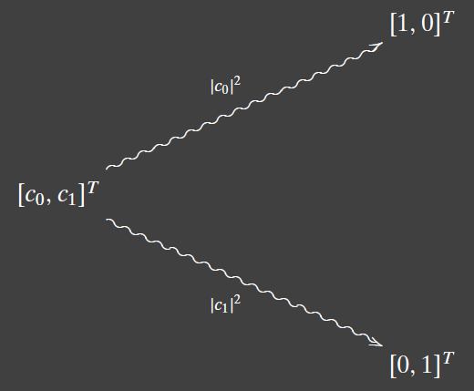

---
title: Architecture
notebook: Quantum Computing
layout: note
date: 2020-12-11
tags: 
...

## Bits and Qubits

- __bit:__ unit of information describing a two-dimensional classical system
- many realisations of a bit:
  - voltage level within a circuit
  - switch turned on/off
  - way to denote true/false
- a bit describes a system whose set of states has size 2: $\{0,1\}, \{\top, \bot\}$
- let's represent each state a bit can taking using a vector:

$$
\ket 0 = 
\begin{bmatrix}
  1 \\
  0 \\
\end{bmatrix},
\ket 1 = 
\begin{bmatrix}
  0 \\
  1 \\
\end{bmatrix},
$$

- note these are orthonormal
- __quantum bit/qubit:__ unit of information describing a two-dimensional quantum system
- represent a qubit as a vector with complex entries:
$$
\begin{bmatrix}
  c_0 \\
  c_1 \\
\end {bmatrix}, |c_0|^2 + |c_1|^2 = 1
$$

- a classical bit is a special case of a qubit
- $|c_0|^2$: probability that, after measuring the qubit, it will be found in state $\ket 0$
- whenever a qubit is measured, it automatically becomes a bit: you never see a general qubit
- qubit collapse 

- the canonical basis of $\mathbb{C^2}$ is just $\{\ket 0, \ket 1\}$ 
## Classical Gates

## Reversible Gates

## Quantum Gates
