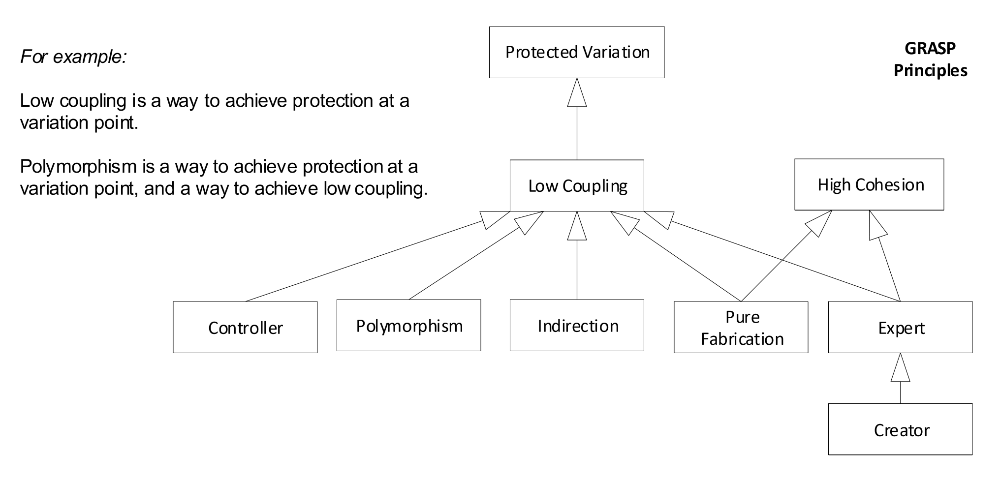

---
title: GRASP
notebook: Software Modelling and Design
layout: note
date: 2020-10-07
tags: 
...

# GRASP

## Table of Contents

<!-- vim-markdown-toc GFM -->

* [GRASP: Overview and Interrelationship](#grasp-overview-and-interrelationship)
* [Responsibilities](#responsibilities)
* [Creator](#creator)
* [Information Expert](#information-expert)
* [Low Coupling](#low-coupling)
* [High Cohesion](#high-cohesion)
* [Controller](#controller)
* [Polymorphism](#polymorphism)
* [Pure Fabrication](#pure-fabrication)
* [Indirection](#indirection)
* [Protected Variations](#protected-variations)
  * [Liskov Substitution Principle](#liskov-substitution-principle)
  * [Don't talk to strangers](#dont-talk-to-strangers)

<!-- vim-markdown-toc -->

## GRASP: Overview and Interrelationship

- General Responsibility Assignment Software Patterns
- __pattern__: named and well-known problem and solution that can be applied to new contexts, providing guidance for 
  assessing trade-offs 



## Responsibilities

- __responsibility__: contract/obligation
- types of responsibility:
  - _doing_: an object could
    - do something itself, e.g. create an object, perform a calculation
    - initiate action in other objects
    - control/coordinate activities in other objects
  - _knowing_: an object could
    - know about private encapsulated data
    - know about related objects
    - know about things it can derive/calculate

- __low representational gap__: domain model can be used to inspire _knowing_ responsibilities 
- __granularity__: big responsibilities may take hundreds of classes/methods, while small ones 
  may take a single method
- responsibilities are distinct from methods: responsibilities are an abstraction, but methods 
  fulfill responsibilities
- __collaboration__: responsibiilities may involve multiple objects working together to fulfill a responsibility

- __Responsibility Driven Design:__ way to think about assigning responsibilities inOO software design, 
  where the design comprises a community of collaborating responsible objects


## Creator

__Problem:__ who should be responsible for object creation?
__Solution:__ Assign class B responsibility to create class A if: 
  - B contains/aggregates A
  - B records A
  - B closely uses A 
  - B has initialising data for A

The more of these that hold, the stronger the implication.
__Benefits:__ Low coupling
__Contraindications:__ 
  - complex object creation, e.g. from a family of classes.  Instead delegate to Factory

## Information Expert

__Problem:__ How to decide which class to assign a responsibility to?
__Solution:__ 
  - Assign X the responsibility if X has the necessary information
__Benefits:__ classes are
  - understandable
  - maintainable
  - extendible
__Contraindications:__ 
  - the solution suggested by Information Expert may introduce problems with coupling and cohesion

## Low Coupling

__Problem:__ how to support low dependency, low change impact, and increased reuse? 
__Solution:__ 
  - assign responsibilities such that coupling remains low. 
  - use this to differentiate alternatives
  - __coupling:__ degree of connection to other elements (whether knowledge/reliance on)
__Benefits:__ code becomes
  - maintainable
  - efficient
  - reusable
__Contraindications:__ 
  - high coupling can be okay with stable code, e.g. standard libraries

## High Cohesion

__Problem:__ How to keep objects focused, understandable, manageable, while suppporting low 
coupling?
  - __functional cohesion:__ how strongly related and focused the responsibilities of an element
    are
  - __low cohesion:__ class performs too many unrelated tasks.  Code is hard to comprehend, reuse,
    maintain
__Solution:__ 
  -  choose between alternatives by assigning the reponsibility to X for maximum cohesion
__Benefits:__ code becomes
  - easy to comprehend
  - maintainable
  - reusable
__Contraindications:__ 
  - non-functional requirements may require low cohesion, e.g. reduce processing overheads in high-
    performance computing

## Controller 

__Problem:__  What first object beyond the UI layer receives and coordinates (i.e. controls) system operation?
__Solution:__ 
  - __facade controller:__ assign responsibility to a class representing the overall system
  - __use case/session controller:__ assign responsibility to a class representing a use case 
    scenario that deals with the event, named something like 
    `<UseCaseName><Handler|Coordinator|Session>`
__Benefits:__  prevent coupling between UI and application logic
__Issues:__ 
  - __bloated controller__: controllers with too many responsibilities (low cohesion)
    - break facade controller into multiple use case controllers
    - delegate work to other objects: only handle control in the controller itself


## Polymorphism

__Problem:__ 
  - how to handle alternatives based on _type_ (class)?
    - conditional variation using `switch-case` statements requires heavy modification when new 
    alternatives are added
  - how to create pluggable software components?
    - viewing components in a client-server relationship, how can you replace a server component
      without affecting the client?

__Solution:__ when related alternatives/behaviours vary by type (class), assign responibility for 
the behaviour using polymorphic operations to the types (classes) for which the behaviour varies.
  - i.e. give the same name to services in different objects
  - i.e. inheritance with generalisation/specialisation, or interfaces
__Corollary:__ avoid testing the type of an object as part of conditional logic to perform varying
alternatives based on type (class).
__Guideline:__ unless there is a default behaviour in the superclass, declare a polymorphic 
operation in the superclass to be `abstract`.
__Guideline:__ when should you consider using an interface?  
  - introduce one when you want to support polymorphism without being committed to a class hierarchy
__Benefits:__ 
  - easy extension of code: you can introduce new implementations without affecting clients
__Contraindications:__ 
  - avoid premature optimisation: consider future proofing with respect to realistic likelihood
    of variability before investing time in increased flexibility.

## Pure Fabrication

__Problem:__ what object should have a responsibility, where you don't want to violate high 
cohesion/low coupling, etc., but guidance from Expert etc. is not appropriate?
__Solution:__  assign a highly cohesive set of responsibilities to an artificial/convenience class
that doesn't exist in the problem domain.
__Benefits:__ 
  - high cohesion
  - reuse potential
__Contraindications:__ 
  - overuse where each class is basically a single function: produces high coupling and lots of 
    message passing

## Indirection

__Problem:__ 
  - where to assign responsibility to avoid direct coupling between 2+ things?
  - how to decouple to support low coupling and reuse potential?
__Solution:__ 
  - assign responsibility to an intermediary, creating indirection between components
  - e.g. `Adapter` to protect inner design against external variation
  - "Most problems in computer science can be solved by another layer of indirection"
__Benefits:__ 
  - reduced coupling
__Contraindications:__ 
  - high performance may need to reduce amount of indirection
  - "Most problems in performance can be solved by removing another layer of indirection"


## Protected Variations

__Problem:__ How to design objects/systems so that variation in these elements doesn't impact other 
elements?
__Solution:__ 
  - identify points of predicted variation/instability
  - assign responsibilities to create a stable interface (in the broad sense of an access view)
    around them
  - points of change:
    - __variation point:__ variation in existing system/requirements
    - __evolution point:__ speculative variations that may arise in the future
  - equivalent to __Open-Closed principle__: objects should be open for extension, and closed to 
    modification that affects clients
  - equivalent to __Information Hiding__
__Benefits:__ 
  - extensible
  - new implementations don't affect clients
  - low coupling
  - low cost of change
__Contraindications:__ 
  - cost of future-proofing can outweigh benefits
  - reworking a brittle design as needed may be easier
__Guidance:__
  - novice developers produce brittle designs
  - intermediate developers produce overly fancy/flexible, generalised designs that never get used
  - expert developers choose with insight, balancing the cost of changing a simple/brittle design 
    against its likelihood

### Liskov Substitution Principle

- software (methods, classes, ...) referring to a type `T` (interface, abstract superclass) should
  work properly with any substituted implementation or subclass of `T`

### Don't talk to strangers

Avoid creating designs that traverse long object structure paths and/or send messages to distant,
indirect (stranger) objects. doing so makes designs fragile with respect to changes in 
object structures.

Within a method, messages should only be passed to:

1. `this` object (`self`)
2. parameter of the method
3. attribute of `this`, (or element of collection that is an attribute of `this`)
4. object created in the method

__Intent:__: avoid coupling between client and knowledge of indirect objects, and connections 
between objects.

```java
public void doX() {
    // avoid this
    F someF = foo.getA().getB().getC().getD().getE().getF();
    // this is better
    F someF = foo.getFfromFoo();
}
```

__Guideline:__ The farther along a path one traverses, the more fragile it will be.  Instead add a
public operation to direct objects that hides how the information is obtained.


