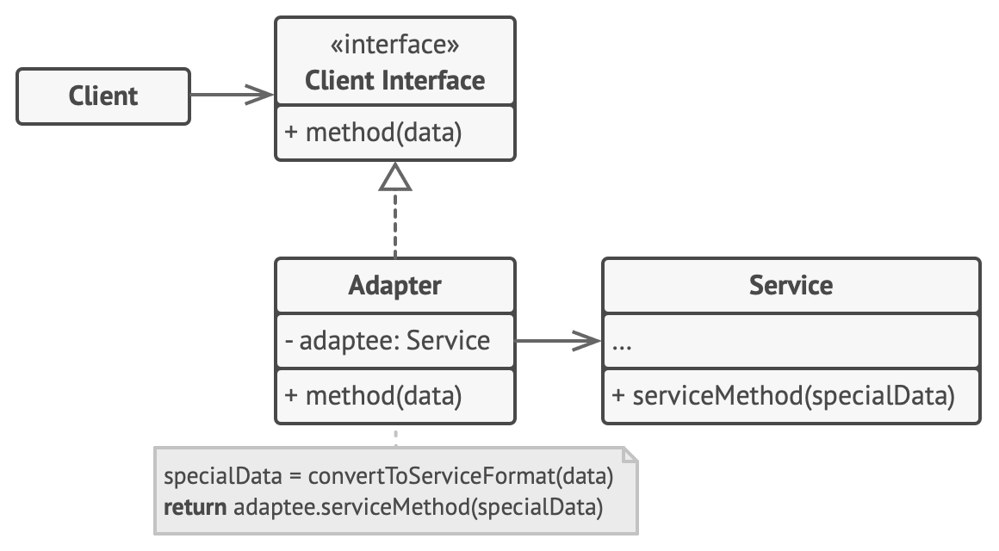

---
title: Gang of Four Patterns
notebook: Software Modelling and Design
layout: note
date: 2020-10-07
tags: 
...

# Gang of Four Patterns

[TOC]: #

Content and images from Larman: Applying UML and [Refactoring Guru](https://refactoring.guru)

## Taxonomy

### Behavioural

- Strategy
- Template
- Observer

### Creational

- Factory
- Singleton

### Structural

- Adapter
- Composite
- Decorator
- Facade

## Adapter

- use the pattern name in the type name

__Problem:__ 
- how to resolve incompatible interfaces?
- how to provide a stable interface for similar components with different interfaces?

__Solution:__ Convert the original interface of a component into another interface through an intermediate
adapter object

__Implementation:__



_Example: airline flights_

```java 
// flight adapter interface
public interface IFlightAdapter {
    String from();
    String to();
    String departureTime();
    String arrivalTime();
}

public VirginFlightAdapter implements IFlightAdapter {
    // context maintained within the adapter
    VirginFlight flight;

    VirginFlightAdapter(VirginFlight flight) {
        this.flight = flight;
    }

    // implement methods of interface by calling services of VirginFlight
    public String from() {
        return flight.getDeparture();
    }
}

public QantasFlightAdapter implements IFlightAdapter { ... }

public JetstarFlightAdapter implements IFlightAdapter { ... }

// singleton factory to create adapters
public AirlineAdapterFactory {
     
    public static AirlineAdapterFactory getInstance() { ... }

    public IFlightAdapter getFlightAdapter(Object Flight) {
        // determine correct adapter to create
        if (flight instanceof VirginFlight) {
            return new VirginFlightAdapter(flight);
        } else if (...) {
            // ...
        }
    }
}
```

__Related:__ 
- resource adapter hiding an external system is similar to a Facade.  The point of difference is that 
  a resource adapter exists to permit adaptation to varying external interfaces, wrapping a single object,
  while a Facade wraps an entire subsystem
- may use a Factory to create Adapters

__Pros:__
- single responsibility principle: separation of interface/data conversion from primary business logic
- open/closed principle: you can add new adapters without breaking client code

__Cons:__
- increased complexity.  Might be easier to modify the service class


## Factory

- simple factory, concrete factory
- simplification of GoF _Abstract Factory_

__Problem:__ 
- who should be responsible for complex object creation? 
- how to maintain high cohesion so that objects used by a class don't need to be concerned with object creation?

__Solution:__ create a Factory, a Pure Fabrication, that handles object creation

__Implementation:__


__Related:__ 
- Factories are often accessed with the Singleton pattern

__Pros:__
- separate responsibility of complex creation into __cohesive__ helper objects
- hide complex creation logic
- can implement performance enhancing memory management e.g. object caching/recycling

__Cons:__
- additional complexity

## Singleton

__Problem:__ 
- need global access to an object to avoid large amounts of message passing, which could produce high coupling
- need exactly one instance of some object

__Solution:__ use a Singleton class which has only one instance, providing a global point of access through a static method
- why not simply make all service methods `static` methods of the class?
  - instance methods permit subclassing; static methods are not polymorphic and usually can't be overridden
  - OO remote communication methods (e.g. RMI) typically only support instance methods, rather than static ones
  - class may be useful in other contexts, where it need not be a singleton.  Instance methods therefore make it more
    flexible

__Implementation:__

```java
public class Singleton {
    private static instance = null;

    public static Singleton getInstance() {
        if (instance == null) {
            instance = new Singleton();
        }
        return instance;
    }
}
```

__Related:__ 
- often used for Factory objects, Facade objects

__Pros:__
- solves the problems of global access and single instance
- lazy initialisation of the instance: you only construct a Singleton on request

__Cons:__
- violates single responsibility principle: solves global access/single instance at the same time
- can mask bad design: components may know too much about each other (high coupling)

## Strategy

__Problem:__ 
- how to design for varying but related algorithms?  
- how to allow runtime selection of these algorithms/policies?

__Solution:__ define each algorithm in a separate class, implementing a common interface

__Implementation:__
- a strategy object is passed the context object, which it uses to apply the algorithm


```java
public interface RouteStrategy {
    Route getRoute(Location A, Location B);
}

public class CycleStrategy implements RouteStrategy {
    public Route getRoute(Location A, Location B) {
        // get cycling route
        // ...
        return cycleRoute;
    }
}

public class BusStrategy implements RouteStrategy { ... }

public class TrainStrategy implements RouteStrategy { ... }
```

__Related:__ 
- strategies can be created by a Factory

__Pros:__
- strategy can be selected/changed at runtime
- provides __polymorphism__ to context object, which doesn't need to know particulars of the strategy, but simply
  uses the services of the interface
- provides __protected variations__, as algorithms are able to be modified without affecting the client
- open/closed principle: you are able to introduce new strategies without modifying the context

__Cons:__
- may be overly complicated when you have stable algorithms that are few in number
- clients still need to know how to select the correct algorithm
- anonymous functions may be a lightweight alternative

## Composite

__Problem:__ how to treat a group/composition structure of objects the same way (polymorphically) as a non-composite
(atomic) object?
- e.g. conflicting complex pricing strategies: best for customer taking into account day of the week discount, seniors
  discount, sale etc.

__Solution:__ define classes for both atomic and composite objects, both implementing the same interface
- the composite object maintains a collection of other objects implementing the same interface
- works when you can represent object structure as a tree
- use it to make client treat atomic/composite objects uniformly

__Implementation:__


__Notes:__
- _IDs to objects:_ often rather than just passing around strings of IDs it ends up more flexible to create a full-fledged
  object.  This way it encapsulates a set of information and can have behaviour. 
- _pass aggregate object as parameters_: avoid extracting child objects out of parent/aggregate objects and then passing around the child (e.g. to a factory)
  - increases flexibility

__Related:__ 
- factory often used to create composites: creation may be complex, so to support high cohesion these tasks should
  be performed in a purpose-built class
- Strategy pattern often goes hand in hand with Composite
- based on polymorphism
- provides protected variations to a client: the client need not know whether it is dealing with an atomic object or a composite one.

__Pros:__
- amenable to polymorphism and recursion, allowing you to easily work with complex tree structures
- open/closed: you can introduce new elements without breaking client code

__Cons:__
- establishing a common interface for classes with very different functionality may require you to generalise
  which can make code hard to understand

## Facade

__Problem:__ need a common, unified interface to a disparate set of implementations/interfaces (e.g. a subsystem)
to prevent undesirable coupling to the subsystem whose implementation may change.
- pluggable business rules

__Solution:__ define a single point of contact to the subsystem via a facade object.  The facade object then wraps the
subsystem.  This provides a unified interface and is responsible for collaborating with subsystem components.
- front-end object that is single point of entry
- useful when you want to layer your system
- if a facade is too large, you might want to refine into distinct, focused facade classes
- good opportunity to focus on designing a good interface

__Implementation:__


Note `ATM` is a controller, while `BankAccountFacade` is the `Facade`.

__Related:__ 
- protected variations provided against changes in the subsystem, as internal details are private
  - the facade is an indirection object
  - low coupling: external objects are coupled to the facade only
- Singleton often used to access Facade
- Adapter is similar in that it wraps access to systems, but usually it is about wrapping variations in external systems, while facade is about
  wrapping an internal broader subsystem.  The intent is different
- Controller handles user input based on business logic, while Facade provides simpler interface for complex subsystem

__Pros:__
- isolate client from subsystem variations 

__Cons:__
- facade can end up highly coupled to all subsystem classes (a god object)

## Observer

- aka _Publish/Subscribe_

__Problem:__ different kinds of subscriber objects are interested in state changes/events of a publisher object,
and want to react in their own unique way when the publisher generates an event.  The publisher wants to maintain
low coupling to the subscribers

__Solution:__  Define a subscriber or listener interface, implemented by subscribers.  The publisher can dynamically
register interested subscribers and notify them when an event occurs.

__Implementation:__


__Related:__ 
- based on Polymorphism
- provides protected variations: protects publisher from knowing the specific class of object/number of objects with which it communicates
  when an event occurs

__Pros:__
- loose coupling between publisher and heterogeneous subscribers
- open/closed principle: you can introduce new subscriber classes without having to modify the publisher
- you can establish relations between objects at runtime

__Cons:__
- subscribers may not be notified in a particular order

## Decorator

__Problem:__ how to dynamically (at run-time) add behaviour/state to individual objects without changing the interface
presented to the client?

__Solution:__ 
- encapsulate the original concrete object inside an abstract wrapper interface.
- _decorators_ with dynamic behaviour also implement this interface
- interface uses recursive composition to allow an unlimited number of decorator layers to be added to each core object
- add behaviours to objects by placing them within special wrapper objects which contain the behaviours
- use this when it is awkward/not possible to extend an object's behaviour with inheritance


__Implementation:__


__Related:__ 
- Adapter changes interface of an existing object, while Decorator enhances the object without modifying 
  the interface. Decorator supports recursive composition. 
- Composite also allows recursive composition, but Decorator has only a single child component, while 
  composite may have many.  Composite aggregates the results of its children, while Decorator adds additional responsibilities.
  Decorator could be used to add responsibilities to a Composite.

__Pros:__
- ability to extend object behaviour without subclassing
- ability to add/remove responsibilities at runtime
- ability to combine multiple behaviours by wrapping an object in multiple decorators

__Cons:__
- can be hard to unwrap a specific wrapper from the wrapper stack
- hard to implement so that behaviour is order independent

