---
title: Summary
notebook: Software Modelling and Design
layout: note
date: 2020-10-07
tags: 
...

# Table of Contents


# Use Cases

- __use case__: informally: text story of an actor using a system to meet goals
  - emphasises user goals and perspective
    - who is using the system?
    - what are their typical scenarios of use?
    - what are their goals?
  - formally: collection of related success/failure scenarios that describe an actor using the SuD to 
    support a goal
  - primarily capture functional requirements
  - define a contract of how a system will behave
- __SuD:__ system under discussion
- __actor:__ something with behaviour; e.g. person, computer system, organisation
- __scenario/use case instance:__ specific sequence of actions/interactions between actors and SuD

## Level of Detail 

- __brief:__ terse one-paragraph summary of the main success scenario
- __casual:__ informal multi-paragraph format covering various scenarios
- __fully dressed:__ formal writing of each step and variations in detail, with supporting material

## Use case variants

- __main success scenario:__ ideal use case; mandatory element
  - "happy path", typical flow
  - usually has no conditions/branching
- __alternative scenario:__ optional, enhances understanding, provides some alternative behaviour
  - covered in Extensions section when fully dressed

## Actors

- __primary actor:__ has user goals fulfilled through using services of SuD
- __supporting actor:__ provides a service to SuD to clarify external interfaces/protocols
  - typically a computer system (e.g. payment authorisation system) but can be an organisation or person
- __offstage actor:__ has an interest in behaviour of the use case, but is not primary/supporting
  - e.g. tax agency
  - important to include to ensure all stakeholder requirements are captured

## Importance

- influences design, implementation, project management
- key source of information for OO analysis/testing
- use cases should be strongly driven by project goals

## Use case Model

- __Use case model:__ model of system functionality/environment
  - _primarily:_ set of _written_ use cases
  - _optionally:_ includes UML use case diagram

## Use case Diagram

- show primary actors on LHS
- show supporting actors on RHS


## Relevance of Use cases

To check whether use-cases are at the right level for application requirements analysis, you can apply a number of tests.

- __Boss test:__ your boss must be happy if, when asking you what you have been doing, you respond with the use case
- __Elementary business process test:__ a value-adding process undertaken by one person in one location in response to a business event
- __Size test:__ tasks shouldn't be a single step.  They shouldn't be too many steps.
  - Fully dressed: 3-10 pages

__Example:__

- negotiate a supplier contract: much broader/longer than an EBP
- handle returns: OK with the boss.  Seems like EBP.  Good size.
- Log in: fails boss test
- Move piece on game board: single step - fails size test.

## Include relationship

- used to reduce repetition in multiple use cases
- refactor common part of use cases into subfunction use case

```text
Extensions: 

6b. Paying by credit: Include Handle Credit Payment.

```


## Extend relationship

- used to add new extensions/conditional steps to a use case
  - base case is complete without the extension
  - extension relies on base case
  - base case doesn't know about extension
- extension analogous to wrapper or subclass
- used infrequently: most often when you cannot modify the original
- where possible, modify use case text instead


# OO Analysis

- __OO analysis:__ creating description of domain from OO perspective
  - analyse use cases and identify objects/concepts in problem domain
  - concepts/behaviours captured in Domain models and Sequence diagrams
  - abstract level of intention
  - intended to help understand the domain
- domain models and system sequence diagrams are the primary artefacts

# Domain Models

- __domain model:__ representation of real-situation conceptual classes
  - not a software object
  - shows noteworthy domain concepts/objects
  - is an OO artefact
  - focus on explaining things and products important to the particular business domain
- represented visually using UML class diagram: show conceptual classes, attributes and associations
- __no method signatures__ defined
- visual dictionary of noteworthy abstractions, domain vocabulary, information content of the domain
- should be recognisable to a non-programmer from the domain
- captures __static context__ of system
- attribute or class?
  - if X not considered a number/text in the real world, X is probably a conceptual class, not
    an attribute
- don't use attributes as foreign keys: show the association

## Identifying conceptual classes

Approaches:

- noun phrase analysis: use carefully, but often suggestive
- use published category list/existing models for common domains

## Associations

- __association:__ relationship between classes indicating a meaningful/interesting connection
- include associations when
  - significant in the domain
  - knowledge of the relationship needs to be preserved

## Attributes

- __attribute:__ logical data value of an object
- include when requirements suggest a need to remember information
- do not show visibility: this is a design detail

## Creating a Domain Model

1. find conceptual classes
2. draw as classes in UML class diagram
3. add associations and attributes

## Description Class

- __description class:__ contains information that describes something else
- used when:
  - groups of items share the same description
  - items need to be described, even when there are currently no instances

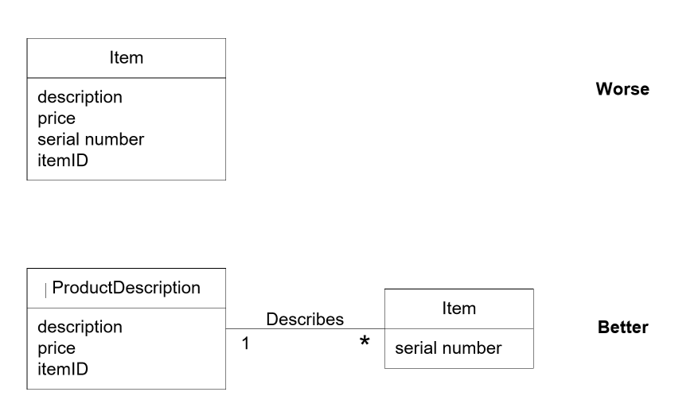

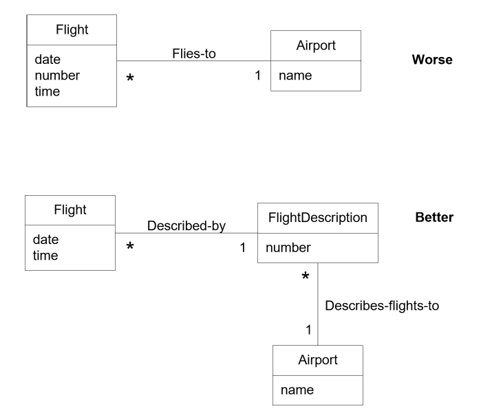

# System Sequence Diagrams

- __system sequence diagram:__ shows chronology of system events generated by external actors
- captures __dynamic context of system__ 
- one SSD for one scenario of a use case
- helps identify external input events to the system (i.e. system events)
- indicates events design needs to handle 
- treat system as a black box: describe what it does without describing implementation details
- choose system events that don't tie you to an implementation
  - events should remain abstract: show intent, not the means
  - e.g. `enterItem` better than `scan`
- all external actors (human or not) for the scenario are shown
- can show inter-system interactions, e.g. POS to external credit payment authoriser


## Communication Diagrams

- different way to convey same information as a sequence diagram

### Closest Store: System Sequence Diagram vs System Communication Diagram

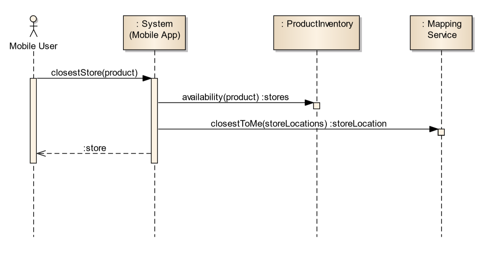

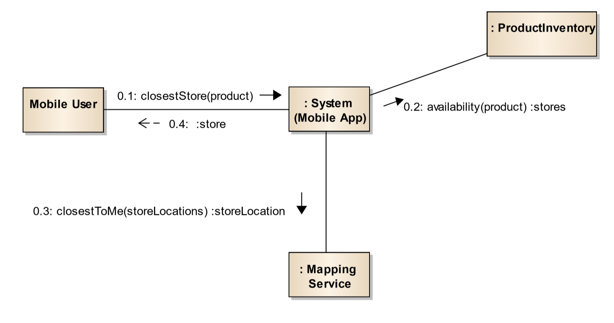

### Pickup before close: SSD vs SCD

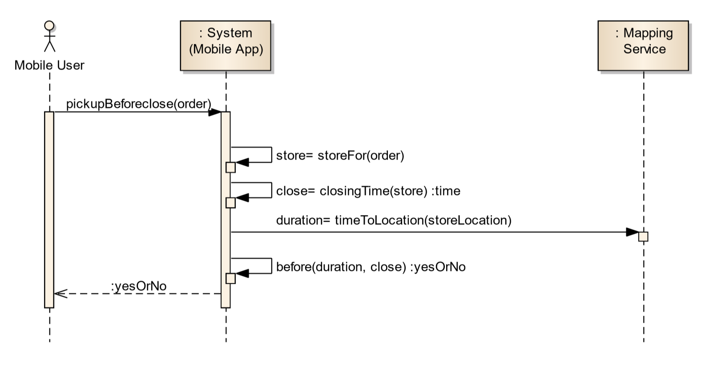

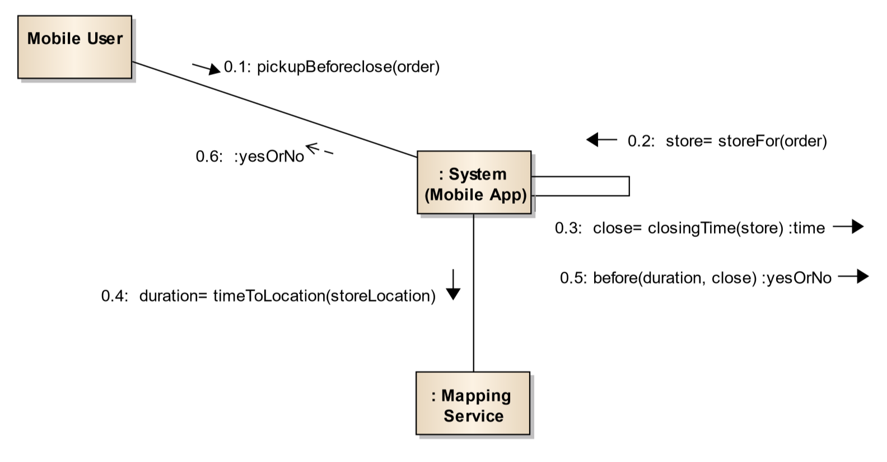

### Combined System Communication Diagram

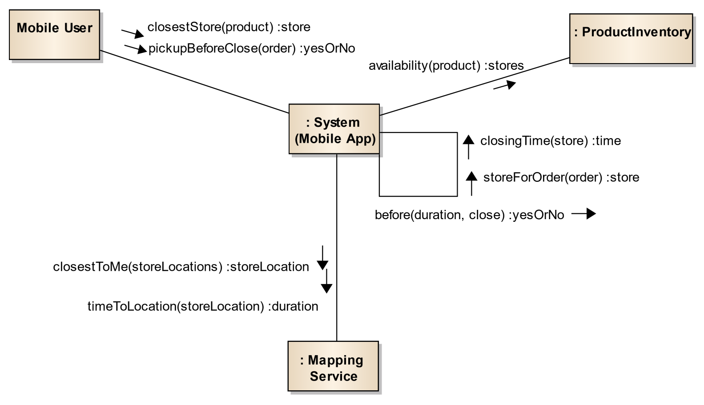

### Message Sequence Numbers

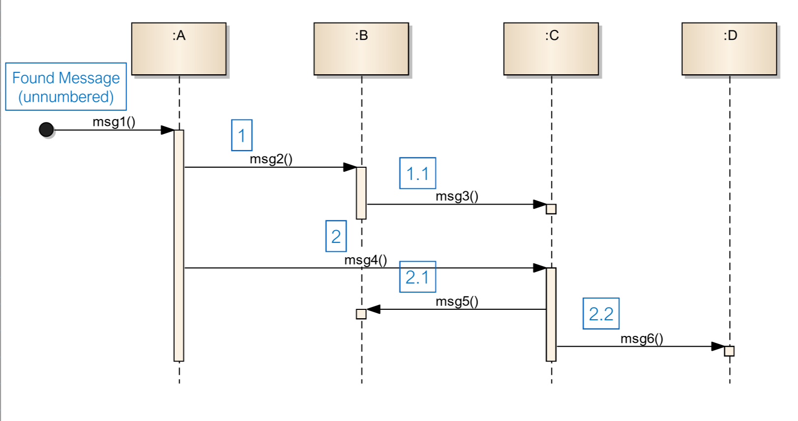

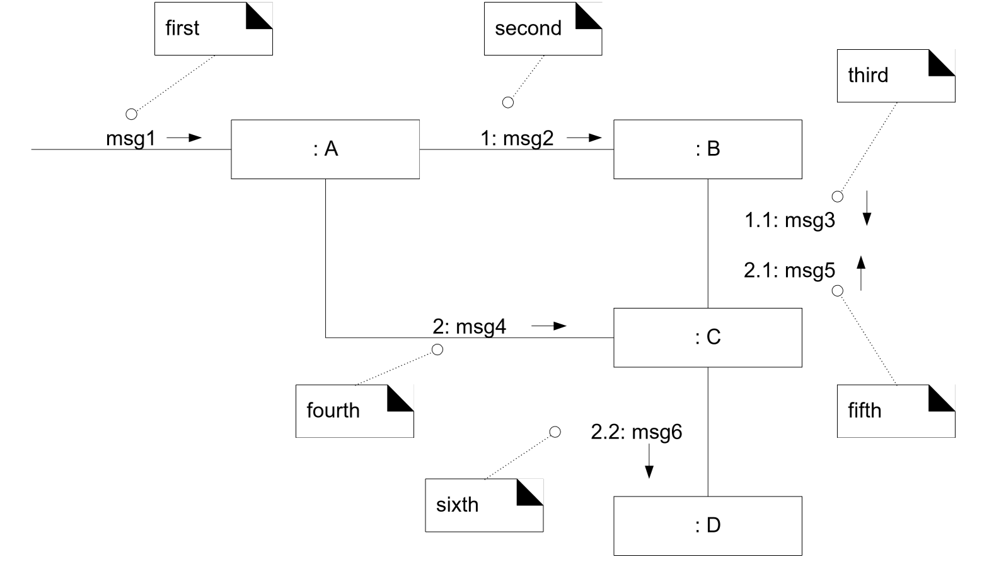

## Sequence vs Communication diagram

- __sequence:__
  - pros: 
    - shows time ordering
    - easy to convey details of message protocols
  - cons
    - linear layout can obscure relationships
    - linear layout consumes horizontal space
- __communications:__
  - pros:
    - clearly show relationships between object instances
    - can combine scenarios to provide a more complete picture
  - cons:
    - more difficult to see message sequencing
    - fewer notation options

# Object-Oriented Design Models

## OO Domain Models

- __Analysis:__ investigation of problem and requirements
- __OO Software Analysis:__ finding and describes objects/concepts in the problem __domain__

## OO Design Models

- __Design:__ conceptual solution that meets the requirements of the problem
- __OO Software Design:__ defining software objects and their collaboration

## Input Artefacts to OO design

- __Use case text__ describes functional requirements that design models must realise
- __Domain models__ provide inspiration for software objects in design models
- __System sequence Diagram__ indicates an interaction between users and system

## OO Software Design

- process of creating conceptual solution: defining software objects and their collaboration
- __architecture__
- __interfaces__: methods, data types, protocols
- assignment of __responsibilities__: principles and patterns

## Output Artefacts of OOSD

- Static model: Design class diagram
- Dynamic model: Design sequence diagram

# Static Design Models

- __static design model:__ representation of software objects, defining class names, attributes
  and method signatures
  - visualised via UML class diagram, called __design class diagram__ 

## Comparison to Domain models

- Domain model: conceptual perspective
  - noteworthy concepts, attributes, associations in the domain
- Design model: implementation perspective
  - roles and collaborations of software objects
- Domain models __inspire__ design models to __reduce the representational gap__
  - talk the same language in software and domain

# Dynamic Design Models

- __dynamic design model:__ representation of how software objects __interact__ via messages
  - visualised as __UML Sequence diagram__ or __UML Communication diagram__
- __Design Sequence diagram:__ illustrates sequence/time ordering of messages between software
  objects
  - helpful in assigning responsibilities to software objects

## SSD vs DSD

- System Sequence Diagram treats the system as a black box, focusing on interactions between 
  actors and the system
- Design sequence diagram illustrates behaviours __within__ the system, focusing on interaction
  between software objects

## Lifeline Notation

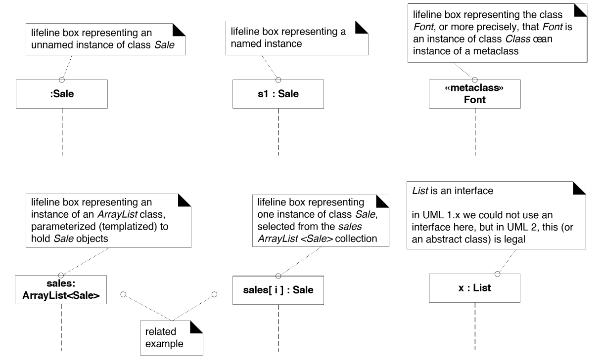

## Reference frames

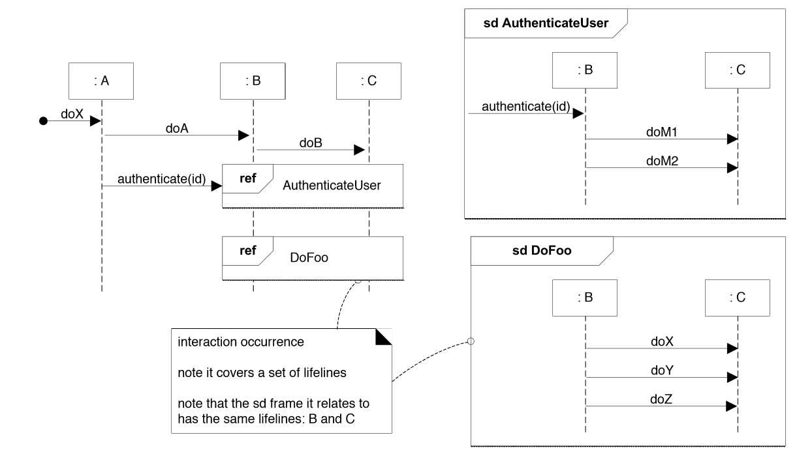

## Loop frames

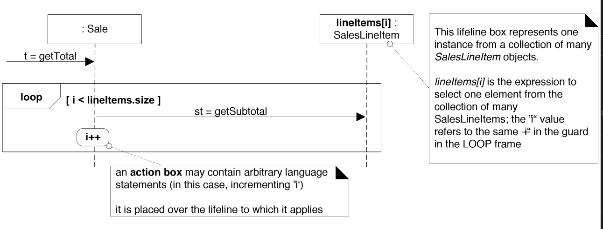

# OO Implementation 

- __Implementation:__ concrete solution that meets the requirements of the problem
- __OO Software Implementation:__ implementation in OO languages and technologies

## Translating design models to code

- build least-coupled classes first, as more highly coupled classes will depend on these
- use `Map` for key-based lookup
- use `List` for growing ordered list
- declare variable in terms of the interface (e.g. `Map` over `HashMap`)

## Visibility

- __visibility:__ ability of an object to see/refer to another object
- objects require visibility of each other in order to cooperate
- e.g. for `A` to send a message to `B`, `B` must be visible to `A`

## Achieving visibility

`A` can get visibility of `B` in 1 of 4 ways:

1. `B` is an attribute of `A`
2. `B` is a parameter of a method of `A`
3. `B` is a (non-parameter) local object in a method of `A`
4. `B` has global visibility

# State Machines

- __state machine:__ behaviour model capturing dynamic behaviour of an object in terms of 
  - __states:__ condition of an object at a moment in time
  - __event:__ significant/noteworthy occurrence that causes the object to change state
  - __transition:__ directed relationship between two states, such that an event can cause
    the object to change states per the transition
- visualised via __UML State machine diagram__

## When to apply state machine diagrams?

- __state-dependent object:__ reacts differently to events depending on its state
  - e.g. elevator
- __state-independent object:__ reacts uniformly to all events 
  - e.g. automatic door
- __state-independent w.r.t a particular event:__ responds uniformly to a particular event
  - e.g. microwave state-independent w.r.t cancel

- Consider state machines for __state-dependent objects with complex behaviour__
- Domain guidance:
  - business information systems: state machines are uncommon 
  - communications/control: state machines are more common (e.g. Berkeley socket)

## UML Details 

- __transition action:__ action taken when a transition occurs
  - typically represents invocation of a method 
- __guard:__ pre-condition to a transition
  - if false, transition does not proceed

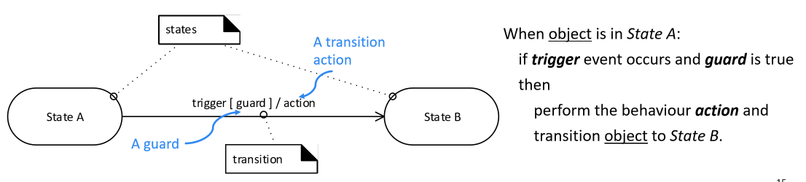

- __nested states:__ substates inherit transitions of the superstate

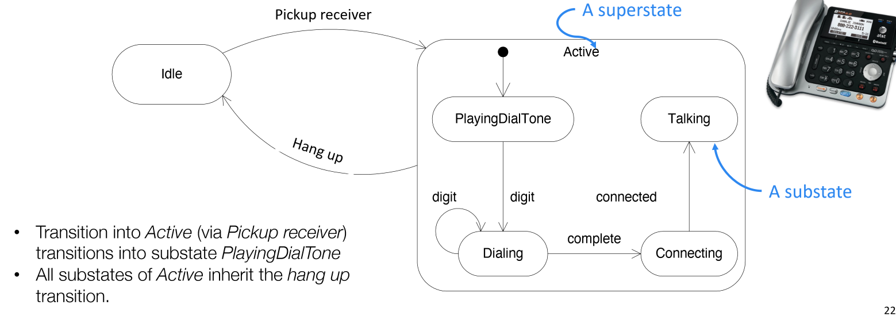

- __choice pseudostates:__ dynamic conditional branch
  - can have as many branches as needed
  - can use an `[else]` branch to follow if no other guards are true 

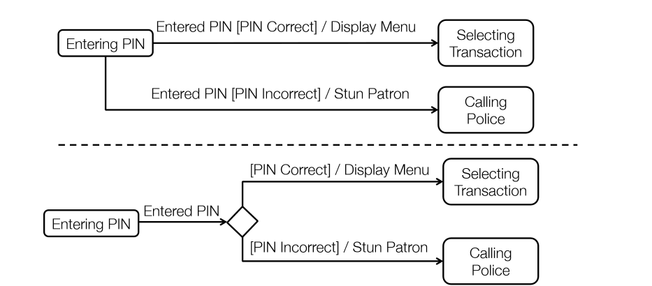

## Implementation Details

- use an enumeration for states

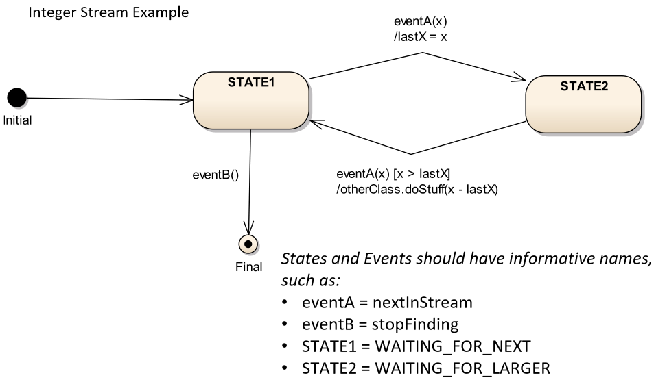

```java
public class IncreasingPairFinder {
  // enum for all the states of the state machine
  enum State { STATE1, STATE2, FINAL }
  // initialise to start state
  State state = State.STATE1;
  int lastX;

  // trigger
  public void eventA(int x) { 
    if (state == State.STATE1) {
      // action
      lastX = x;
      // transition
      state = State.STATE2;
    } else if (state == State.STATE2) {
      // condition
      if (x > lastX) {
        // action
        otherClass.doStuff(x - lastX);
        // transition
        state = State.STATE1;
      }
    } 
  }

  public void eventB() {
    if (state == State.STATE1) {
      state = State.FINAL;
    }
  }
}
```

# Architecture

- Larman: Chs 13, 33

## Software Architecture

- __software architecture:__ large scale organisation of the elements in a software system
- __descisions:__ 
  - __structural elements:__ what are the components of the system?
  - __interfaces:__ what interfaces do elements expose?
  - __collaboration:__ how do the elements work together according to the business logic?
  - __composition:__ how can elements be grouped into larger subsystems?

## Architectural Analysis

- __architectural analysis:__ process of identifying __factors__ that will influence the architecture,
  understand their variability and priority, and resolve them
  - identify and resolve non-functional requirements in the context of functional requirements
  - challenge: what questions to ask, weighing the trade-offs, knowing the many ways to resolve 
    architecturally significant factors
- __goal:__ reduce risk of missing critical factor in the design of a system
  - focus effort on high priority requirements
  - align the product with business goals

Architectural analysis identifies and analyses:

- __architecturally significant requirements:__ are those which can have a significant impact on the 
  system design, especially if they are not accounted for early in the process
- __variation points:__ variation in existing current system/requirements
  - e.g. multiple tax calculator interfaces that need to be supported
- __potential evolution points:__ speculative points of variation that may arise in the future, but are 
  not captured in existing requirements

### Architecturally significant functional requirements

- Auditing
- Licensing
- Localisation
- Mail
- Online help
- Printing
- Reporting
- Security
- System management
- Workflow

### Architecturally significant Non-functional Requirements

- Usability
- Reliability
- Performance
- Supportability

### Effects of requirements on design

- the answer to the following questions significantly affects the system design 
- how do reliability and fault-tolerance requirements affect the design?
  - e.g. POS: for what remote services (tax calculator) will fail-over to local services be allowed?
- how do the licensing costs of purchased subcomponents affect profitability?
  - e.g. more costly database server weighed against development time

### Steps

- start early in _elaboration_ phase
- __architectural factors/drivers:__ identify and analyse architectural factors
  - architectural factors are primarily non-functional requirements that are architecturally significant
  - overlaps with requirements analysis
  - some should have been identified during the _inception_ phase, and are now investigated in more detail
- __architectural decisions:__ for each factor, analyse alternatives and create solutions, e.g.:
  - remove the requirement
  - custom solution
  - stop the project
  - hire an expert

### Priorities

- __inflexible constraints__
  - must run on Linux
  - budget for 3rd party components is X
  - legal compliance
- __business goals__
  - demo for clients at tradeshow in 18 months
  - competitor driven window of opportunity
- __other goals__
  - extendible: new release every 6 months

### Architectural Factor Table

- documentation recording the influence of factors, their priorities, and variability

__Fields__

- Factor
- Measures, quality scenarios
- Variability: current, future evolution
- Impact of factor to 
  - stakeholders
  - architecture
  - other factors
- Priority for success
- Risk

### Technical Memo

- records alternative solutions, decisions, influential factors, and motivations
  for noteworthy issues/decisions

__Contents__

- Issue
- Solution summary
- Factors
- Solution 
- Motivation
- Unresolved Issues
- Alternatives Considered

## Logical Architecture

- __logical architecture:__ large-scale organisation of software classes into __packages, subsystems__ 
  and __layers__
- __deployment architecture:__ mapping of system onto physical devices, networks, operating systems, etc.
  - not a part of logical architecture

### Layered architecture

- __layers:__ coarse-grained grouping of classes, packages, or subsystems that has
  cohesive responsibility for a major aspect of the system
  - very common 
  - vertical division of a system into subsystems
- e.g. 
  - UI 
  - application logic/domain objects
  - technical services: general purpose objects/subsystems e.g. interfaces with DB 
- __strict layered architecture:__ each layer only calls upon the services of the layer directly below it
  - common in network protocol stacks
- __relaxed layered architecture:__ higher layer calls upon several lower layers
  - common in information systems
- __partitions:__ horizontal division of parallel subsystems within a layer
- __benefits:__ 
  - prevent high coupling: changes don't ripple through entire system, and hard to divide work
  - promote reuse: application logic is distinct from UI
  - ability to change underlying technical services

### UML Package Diagram

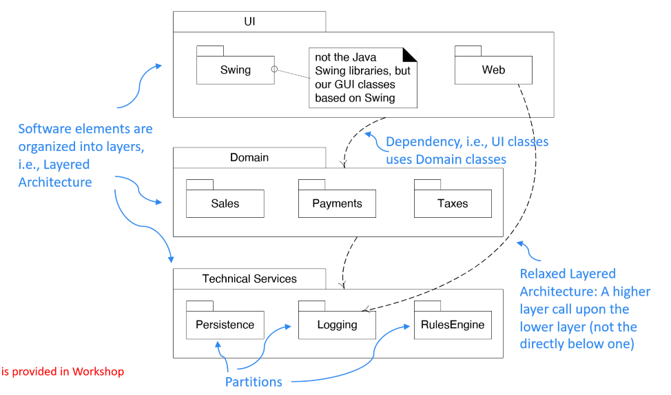


### Information Systems - Typical Logical Architecture

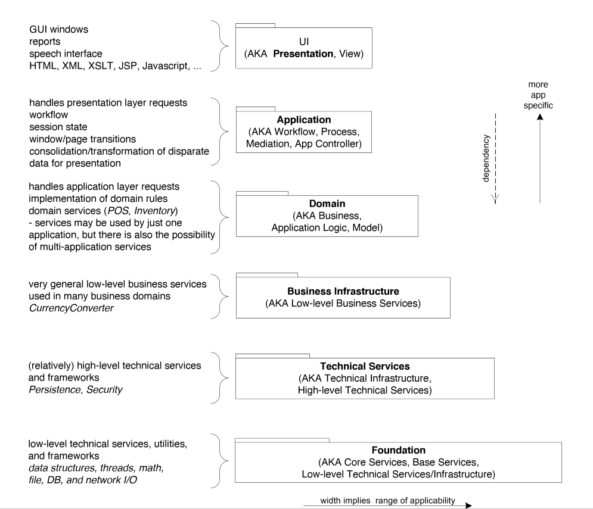

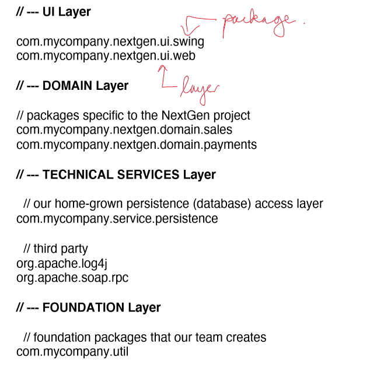

### UML Component Diagram - Implementation View

- __component:__ modular part of a system that encapsulates its contents, and is replaceable within its
  environment
  - can be a class, but can also be external resources (e.g. DB) and services
- __component diagram:__ show how to implement software system at a high level
  - initial architectural landscape of the system
  - defines behaviour: provided/required interfaces

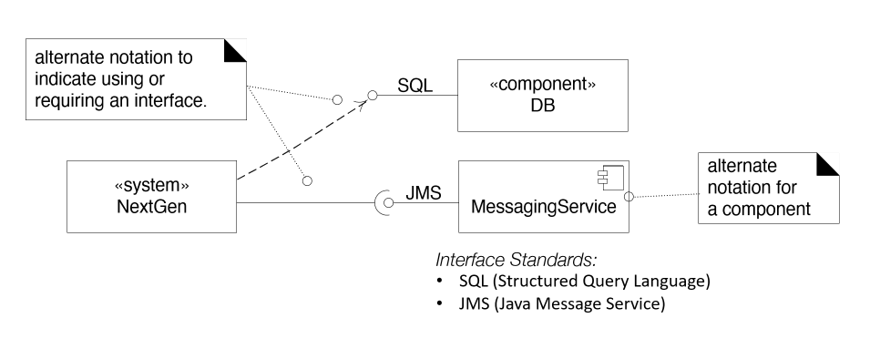

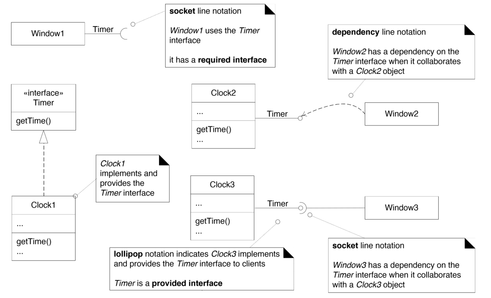

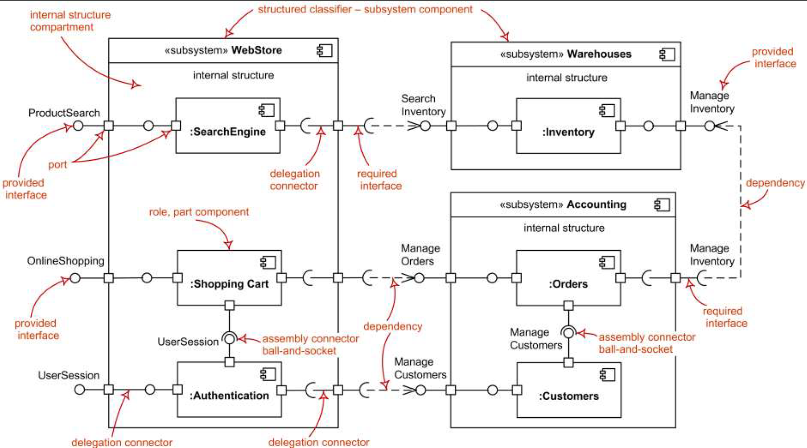

## Distributed Architectures

- components are hosted on different platforms and communicate through a network

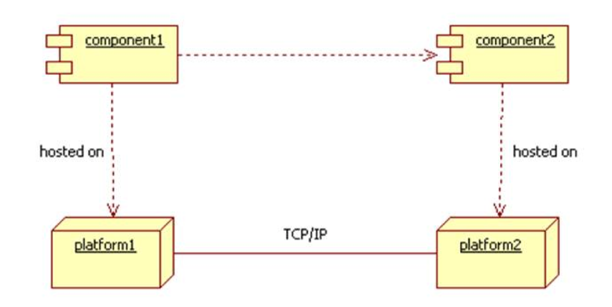

### Client-server

- component types: client, server
- server: listens for client requests
  - processes requests and responds to client
  - can be __stateless__ or __stateful__
  - __stateful:__ allows transactional interactions as __sessions__


### Tiered Client-server 

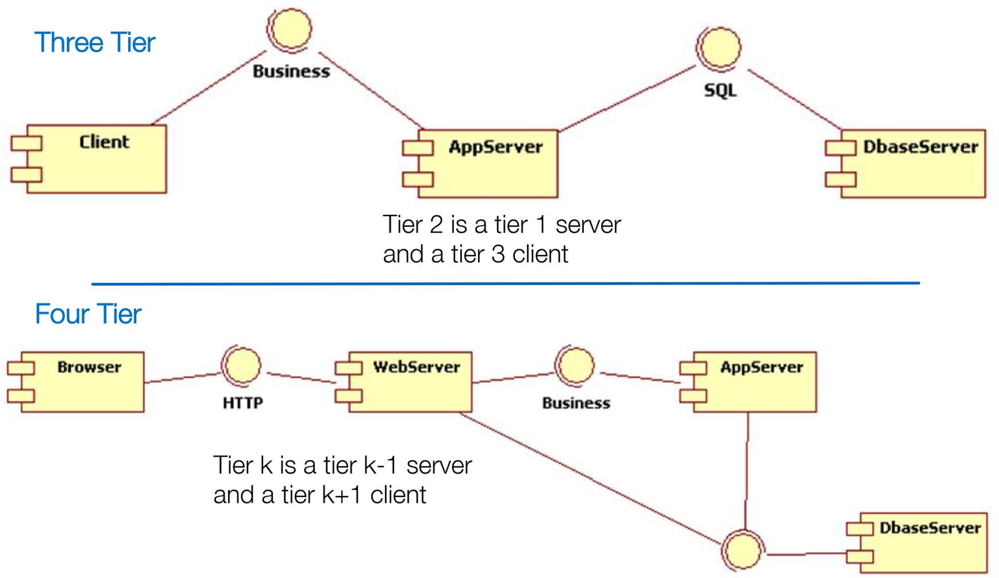

### Peer-to-Peer

- all components act as both client and server

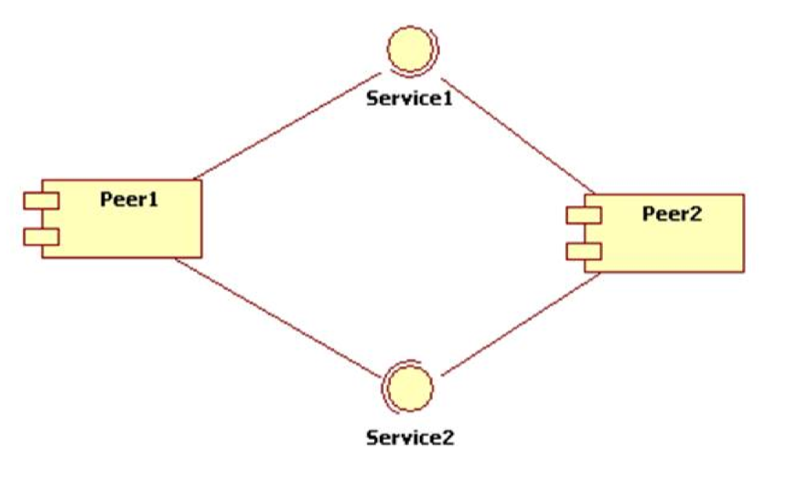

### Pipeline

- __filter__ perpetually reads data from an input __pipe__, processes it, then writes the result to an output pipe
- can be static and linear, or dynamic and complex
- used a lot for graphics and signal processing

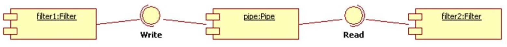

## Architectural Improvement

### Strategies

Options that might be considered: buy, build, modify

- __Buy__: Use COTS
  - pros: short development time, low starting cost
  - cons: business differences, control over software, long term cost
- __Build:__ build a new system from the ground up
  - pros: built-for-purpose for current needs
  - cons: high cost, long timeline, high risk for transition
- __Modify:__ modify existing solution
  - pros: simpler transition, control of software
  - cons: cost and delay tradeoff

- Challenge: planning and executing an acceptable path

### Handling issues: some ideas

- responsiveness: host system locally, reduce Internet communications
- reliability: update networking
- modifiability: remove old/redundant systems
- functionality: add high priority, low complexity features

# Modelling and Design in the Software Process

- Larman: Chs 4, 8, 12, 14
- __Unified Process:__ iterative/incremental software development

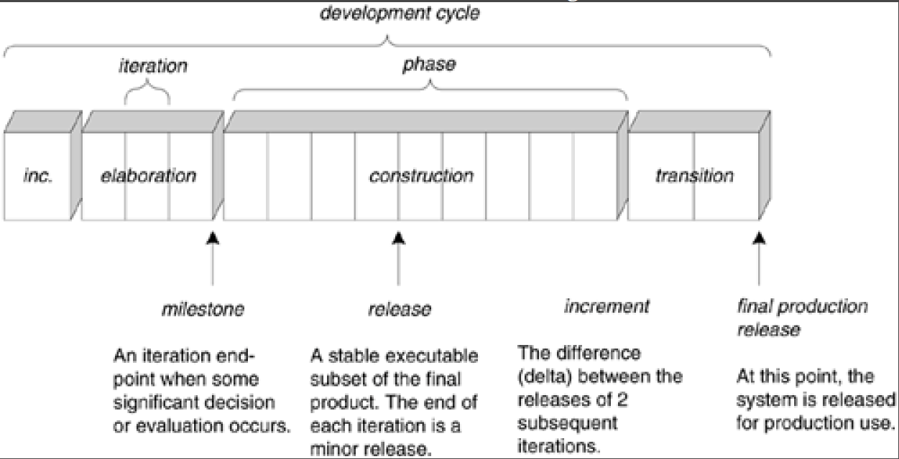

## Artefacts

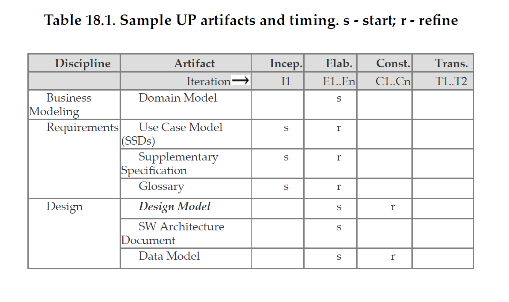

## Inception 

- __inception:__ initial short step to establish common vision and basic scope
- not the time to detail all requirements, and create high fidelity estimates/plans: this happens in 
  elaboration
- answering questions:
  - vision, business case, RoM cost estimates 
  - buy/build?
  - Go/no go?
  - Agreement from stakeholders on vision and value?
- how much UML? Probably only simple UML use case diagrams
- should last ~ 1 week
- artefacts should be brief and incomplete

### Artefacts

[Bold means mandatory]

- __Vision and business case:__ high level goals and constraints, executive summary, business case
- __Use case model:__ functional requirements.  Most use cases name, ~ 10% detailed.
- Supplementary specification: architecturally significant __non-functional requirements__
- glossary
- risk list and mitigation plan
- prototypes, proof of concept
- __iteration plan:__ what to do in 1st elaboration iteration
- phase plan: low fidelity guess of elaboration phase duration and resources
- development case: artefacts and steps for the project

### You're doing it wrong:

1. more than a few weeks spent
2. attempted to define most requirements
3. expect estimates to be reliable
4. defined the architecture
5. tried to sequence the work: requirements, then architecture, then implement
6. you don't have a business case/vision
7. you wrote all uses cases in detail
8. you wrote no use cases in detail

## Elaboration 

- __elaboration:__ initial series of iterations for 
  - building core architecture
  - resolving high-risk elements
  - defining most requirements
  - estimating overall schedule/resources
- after elaboration
  - core, risky software architecture is programmed/tested
  - majority of requirements are discovered/stabilised
  - major risks mitigated/retired
- start production-quality programming and testing for a subset of requirements, __before__ requirements
  analysis is complete
- work on varying scenarios of the same use case over several iterations: gradually extend the system
  to ultimately handle all functionality required

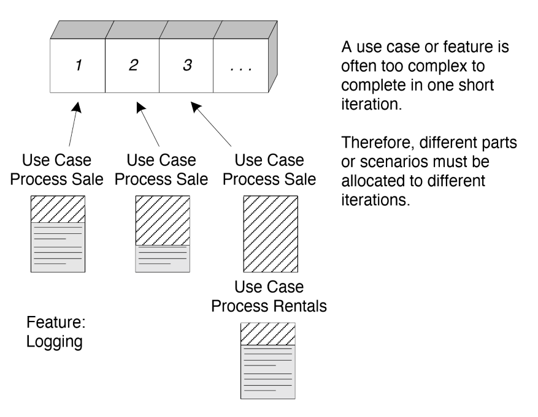

- usually 2+ iterations of 2-6 weeks each, with a fixed end date
- produces the __architectural baseline__
- test early, often, realistically
- adapt based on feedback from tests, users, developers

### Artefacts

- domain model 
- design model
- software architecture document
- data model
- use-case storyboards, UI prototypes

### You're doing it wrong:

1. more than a few months long
2. only has 1 iteration
3. most requirements were defined before elaboration
4. risky elements/core architecture are not being addressed
5. not production code
6. considered requirements/design phase, preceding implementation
7. attempt to design fully before programming
8. minimal feedback/adaptation
9. no early/realistic testing
10. architecture is speculatively finalised, before implementation

# Test-Driven Development and Refactoring

## Test-Driven Development

- __TDD:__ development practise in which test code is written before the code that it will test
  - acceptance tests at the start of an iteration
  - unit tests before the corresponding class is implemented
  - promoted in iterative/agile practice
  - approach
    - alternate between test code and production code
    - ensure production code passes tests before proceeding

### Advantages

- tests actually get written
- improved programmer satisfaction
- clarification of detailed interface and behaviour
- proven, repeatable, automated verification with a test suite
- confidence to make changes

### Unit test the `Sale` class

- before writing `Sale`, write the class `SaleTest`
- choose a method to implement/test e.g. `makeLineItem`
- implement `SaleTest::testMakeLineItem` which:
  - creates a `Sale` test item (__fixture__)
  - add line items to it with `makeLineItem`
  - ask for the total, verify it is as expected via assertions

## Refactoring

- __refactoring:__ structured, disciplined method for rewriting existing code, without changing 
  its external behaviour
  - small, behaviour preserving transformations (__refactors__) are applied, one-by-one
  - run test suite to show refactoring did not cause a __regression__
  - series of small transformation can result in major restructuring of code/design for the better
    with no behaviour change

### Code smells

Code smells are suggestive of a need to refactor

- duplicated code
- big method
- class with many instance variables
- class with lots of code
- strikingly similar subclass
- little/no use of interfaces
- high coupling between many objects

### Refactorings

There are many named refactorings.

- extract method
- extract constant
- extract local variable
- introduce explaining variable
- replace constructor call with factory method

# UML Notes

## Class Diagrams

### Dependency

- dependency shows coupling between classes
- use the dependency line to depict global, parameter variable, local variable,
  and static-method dependency between objects
- optional label:
  - `<<call>>`
  - `<<create>>`

### Composite Aggregation

- __aggregation:__ loosely suggests whole-part relationships
  - vague, no meaningful distinct semantics versus a plain association
  - use composition instead, where appropriate
- __composite aggregation/composition:__ strong kind of whole-part aggregation, where a composite aggregates parts, implying:
  - an instance of the part (e.g. `Square`) belongs to only __one__ composite instance at a time (e.g. `Board`)
  - part must __always belong to a composite__
  - composite is responsible for creating/deleting its parts (whether directly, or by collaborating)
  - if the composite is destroyed, its parts must be destroyed or attached to another composite
- Notation: filled diamond on an association line (at the composite end)
- Guideline: association name in composition is always implicitly some variation of "Has-part"
  - don't bother explicitly naming it

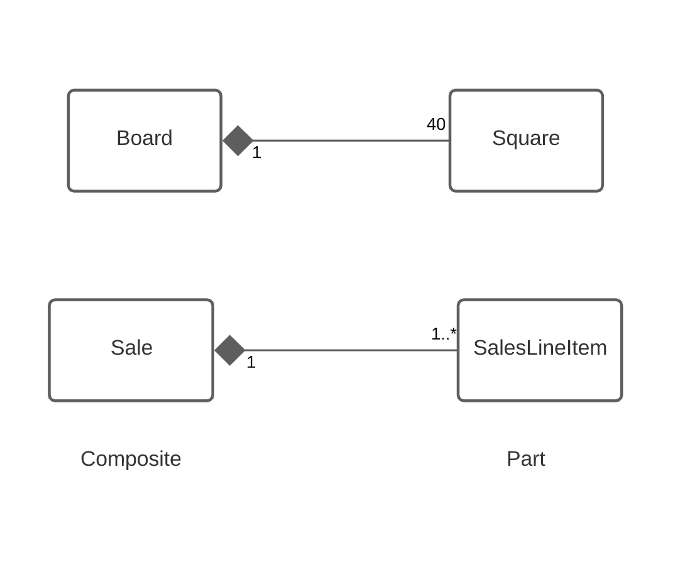
