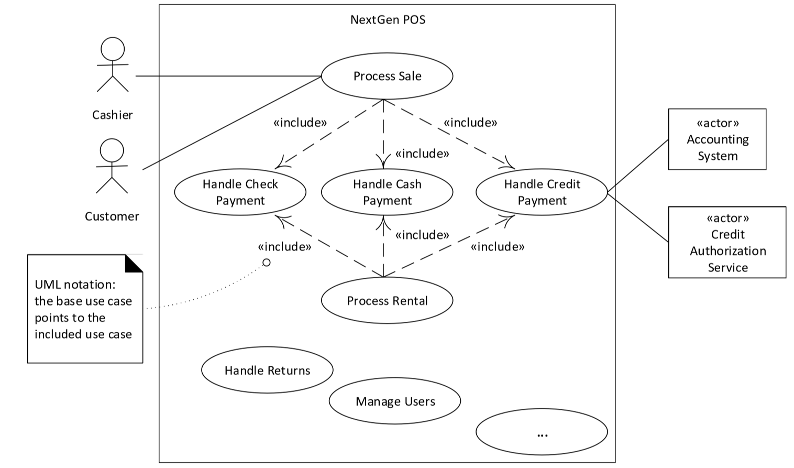

---
title: Summary
notebook: Software Modelling and Design
layout: note
date: 2020-10-07
tags: 
...

# Summary

## Table of Contents


## Use Cases

- __use case__: informally: text story of an actor using a system to meet goals
  - emphasises user goals and perspective
    - who is using the system?
    - what are their typical scenarios of use?
    - what are their goals?
  - formally: collection of related success/failure scenarios that describe an actor using the SuD to 
    support a goal
  - primarily capture functional requirements
  - define a contract of how a system will behave
- __SuD:__ system under discussion
- __actor:__ something with behaviour; e.g. person, computer system, organisation
- __scenario/use case instance:__ specific sequence of actions/interactions between actors and SuD

### Level of Detail 

- __brief:__ terse one-paragraph summary of the main success scenario
- __casual:__ informal multi-paragraph format covering various scenarios
- __fully dressed:__ formal writing of each step and variations in detail, with supporting material

### Use case variants

- __main success scenario:__ ideal use case; mandatory element
  - "happy path", typical flow
  - usually has no conditions/branching
- __alternative scenario:__ optional, enhances understanding, provides some alternative behaviour
  - covered in Extensions section when fully dressed

### Actors

- __primary actor:__ has user goals fulfilled through using services of SuD
- __supporting actor:__ provides a service to SuD to clarify external interfaces/protocols
  - typically a computer system (e.g. payment authorisation system) but can be an organisation or person
- __offstage actor:__ has an interest in behaviour of the use case, but is not primary/supporting
  - e.g. tax agency
  - important to include to ensure all stakeholder requirements are captured

### Importance

- influences design, implementation, project management
- key source of information for OO analysis/testing
- use cases should be strongly driven by project goals

### Use case Model

- __Use case model:__ model of system functionality/environment
  - _primarily:_ set of _written_ use cases
  - _optionally:_ includes UML use case diagram

### Use case Diagram

- show primary actors on LHS
- show supporting actors on RHS


### Relevance of Use cases

To check whether use-cases are at the right level for application requirements analysis, you can apply a number of tests.

- __Boss test:__ your boss must be happy if, when asking you what you have been doing, you respond with the use case
- __Elementary business process test:__ a value-adding process undertaken by one person in one location in response to a business event
- __Size test:__ tasks shouldn't be a single step.  They shouldn't be too many steps.
  - Fully dressed: 3-10 pages

__Example:__

- negotiate a supplier contract: much broader/longer than an EBP
- handle returns: OK with the boss.  Seems like EBP.  Good size.
- Log in: fails boss test
- Move piece on game board: single step - fails size test.

### Include relationship

- used to reduce repetition in multiple use cases
- refactor common part of use cases into subfunction use case

```text
Extensions: 

6b. Paying by credit: Include Handle Credit Payment.

```



### Extend relationship

- used to add new extensions/conditional steps to a use case
  - base case is complete without the extension
  - extension relies on base case
  - base case doesn't know about extension
- extension analogous to wrapper or subclass
- used infrequently: most often when you cannot modify the original
- where possible, modify use case text instead


## OO Analysis

- __OO analysis:__ creating description of domain from OO perspective
  - analyse use cases and identify objects/concepts in problem domain
  - concepts/behaviours captured in Domain models and Sequence diagrams
  - abstract level of intention
  - intended to help understand the domain
- domain models and system sequence diagrams are the primary artifacts

## Domain Models

- __domain model:__ representation of real-situation conceptual classes
  - not a software object
  - shows noteworthy domain concepts/objects
  - is an OO artifact
  - focus on explaining things and products important to the particular business domain
- represented visually using UML class diagram: show conceptual classes, attributes and associations
- __no method signatures__ defined
- visual dictionary of noteworthy abstractions, domain vocabulary, information content of the domain
- should be recognisable to a non-programmer from the domain
- captures __static context__ of system

### Identifying conceptual classes

Approaches:

- noun phrase analysis: use carefully, but often suggestive
- use published category list/existing models for common domains

### Associations

- __association:__ relationship between classes indicating a meaningful/interesting connection
- include associations when
  - significant in the domain
  - knowledge of the relationship needs to be preserved

### Attributes

- __attribute:__ logical data value of an object
- include when requirements suggest a need to remember information

## System Sequence Diagrams

- __system sequence diagram:__ shows chronology of system events generated by external actors
- one SSD for one scenario of a use case
- helps identify external input events to the system (i.e. system events)
- treat system as a black box: describe what it does without describing implementation details
- captures __dynamic context of system__ 


- choose system events that don't tie you to an implementation
- can show inter-system interactions, e.g. POS to external credit payment authoriser
- indicate events design needs to handle 
